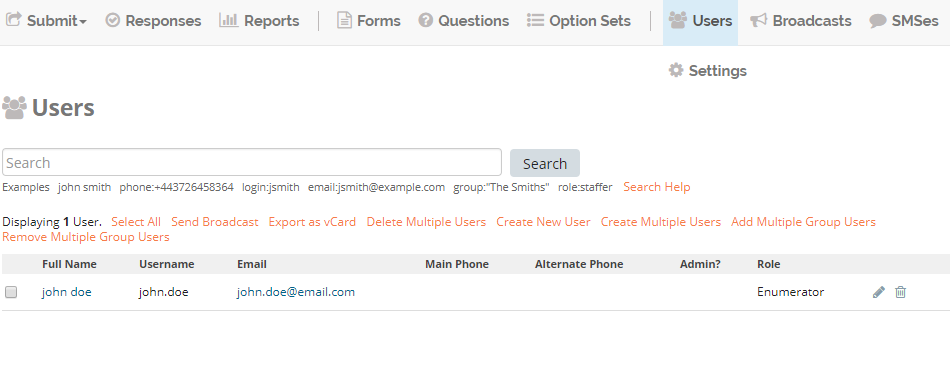

*******************************
Contributing to NEMO Docs
*******************************

.. docs-tech-guide:

Authoring Tools and Environment
=====================================

.. note::

  Developer and authoring tools have lots of options and alternatives. Local tools and workflows presented in this guide are what the author feels would be easiest for a non-coding contributor to set up and use.

.. _docs-as-code:

Docs as code
----------------

NEMO Documentation follows (as much as possible) the `Docs like Code <http://www.writethedocs.org/guide/docs-as-code/>`_ philosophy. This means:

- Documentation source files are written in a plain text format. (We use `reStructuredText <http://docutils.sourceforge.net/rst.html>`_.)
- Documentation source files are kept under version control. (We use git and `Github <https://github.com/thecartercenter/nemo-doc>`_.)
- Documentation is built from source to published output using a static site generator. (We use `Sphinx <http://sphinx-doc.org>`_.)

`The 'Docs as Code' approach has many advantages <http://hackwrite.com/posts/docs-as-code/>`_, but we are aware that this approach can feel difficult for writers who aren't used to dealing with the command line. It can also be difficult for coders who are used to this approach, but who typically use simpler authoring tools (like `Jekyll <http://jekyllrb.com>`_ and `Markdown <https://guides.github.com/features/mastering-markdown/>`_).

This section of the Contributor Guide walks through our authoring and publishing workflow and toolchain, to make it as easy as possible for you to contribute.

.. _docs-workflow-overview:

Overview of workflow
-----------------------

When you first get started you'll need to:

- Fork to your own Github Account
- Clone it down to your local machine
- Install dependencies

And then each time you work you will:

- Make a branch for a specific task
- Make commits as you go
- Build and view the docs locally
  - Correct any errors and commit
- Push your branch to your Github fork
- Issue a pull request against the current working branch of the main repo (usually ``master``)
- Pull latest back to your local machine from the main repo
- Repeat

.. _docs-dev-setup:

Setting up your environment
----------------------------

.. _docs-terminal:

Terminal (Command Line)
~~~~~~~~~~~~~~~~~~~~~~~~~~~

.. warning::

  This contributor guide is written primarily from a \*nix (Bash Terminal) perspective, which is relevant to all flavors of Linux and MacOS. We consider the Bash terminal commands to be the "canonical" way to build and work with the docs.

  We have also provided explanations for how to adapt these commands to the Windows Command Prompt. (This is different than Windows Powershell, and not all the commands will work in Powershell. For more details on the Windows Command Prompt, `see this article <https://www.lifewire.com/how-to-open-command-prompt-2618089>`_

  If you are on a Windows machine, you may prefer to use the adapted Windows instructions here. Alternatively, you can follow the Bash commands:

  - use the `Linux subsystem (Windows 10) <https://www.howtogeek.com/249966/how-to-install-and-use-the-linux-bash-shell-on-windows-10/>`_
  - use a bash terminal emulator, such as

    - Cygwin
    - `gitbash <https://git-for-windows.github.io/>`_

  The lead maintainers of this docs repo are not Windows users, so we rely on our contributor community to keep Windows-specific information complete and accurate. Contributions to this guide with explanations and help for Windows users are greatly appreciated.

Contributing to the docs requires interacting with git, Github, Python, and Sphinx, which requires the use of the Terminal. This is common among Linux users. Mac users unfamiliar with the Terminal can learn more from `this tutorial <https://computers.tutsplus.com/tutorials/navigating-the-terminal-a-gentle-introduction--mac-3855>`_.

.. _docs-python:

Python
~~~~~~~~

.. _docs-python3:

Python 3
""""""""""""

If you don't know, check to see if you have Python 3 installed:

.. code-block:: console

  $ python3

On windows:

.. code-block:: doscon

   > python

If you get an error, you probably don't have it and will need to `install Python 3 <https://www.python.org/downloads/>`_.

On Windows make sure to select the option "Add python to the Path", while installing (see `instructions <https://www.youtube.com/watch?v=oHOiqFs_x8Y>`_ ) otherwise you need to add it `manually <https://youtu.be/UTUlp6L2zkw>`_ .

If the Python command-line interpreter starts up, type ``quit()`` to exit.

.. _docs-gh-git:

Github and git
~~~~~~~~~~~~~~~~~

Git is a distributed version control system. It makes it possible to track changes in files over time, merge changes made by different contributors, compare different versions of the same file, and revert a file to an earlier point. Git can be very complicated, but you do not need to understand its advanced features or inner workings to use it.

GitHub is an online service that lets individuals and organizations host git repositories. It also provides additional collaboration tools like issue trackers. Open Data Kit uses GitHub for its public code and documentation projects.

You will need to:

- `Install git <https://git-scm.com/downloads>`_
-  Make sure that git is installed properly by typing (git) in the terminal or command prompt

   - On windows if you get any error check if environment variables are set up correctly(`see instructions <https://stackoverflow.com/questions/26620312/installing-git-in-path-with-github-client-for-windows#answer-34767523>`_)

- `Start a GitHub account <https://github.com/>`_

.. _docs-workflow-setup:

Getting ready to work
-----------------------

.. _fork-the-docs:

Clone the docs
~~~~~~~~~~~~~~

Go to the `NEMO Doc repo on Github <https://github.com/thecartercenter/nemo-doc>`_, select the :guilabel:`Clone or download` button. Copy the URI from the text box that opens up. It will be something like: ``https://github.com/your-gh-username/docs.git``

Open your terminal, and `cd` to your preferred directory. Then `git clone` the repo:

.. code-block:: console

  $ git clone https://github.com/your-github-username/docs.git
  .
  .
  .
  $ cd docs

The rest of the documentation assumes you are in the directory for the repo (the directory containing ``conf.py`` and ``index.rst``).

.. _install-doc-dependencies:

Install dependencies
~~~~~~~~~~~~~~~~~~~~~~~

The first time you clone down the repo, you'll need to install the dependencies. Make sure you have your Python 3 virtual environment set up and activated in the docs repo and then:

.. code-block:: console

  $ pip install -r requirements.txt

.. note::

  If you are working on the design, testing, or deployment of the docs, you might find the need to install an additional PyPi package. If you do, please update the requirements.txt file with ``pip freeze > requirements.txt``. Pull Requests which change :file:`requirements.txt` should include a note about why the new packages are needed.

.. note::

  If you have problems when running the Sphinx commands (see below), you may have a dependency issue. Try running ``pip install -r requirements.txt`` again.

.. _docs-workflow-details:

Workflow details
-------------------

.. _git-branch-the-docs:

Make a new branch
~~~~~~~~~~~~~~~~~~~

Create a new branch in which you will work on a specific issue. The branch name should briefly describe what you are doing. For example, the original author of this contributor guide worked in a branch he called ``contributing``. Also, make sure that all the branches are derived from the ``master`` branch to avoid intermixing of commits.

.. code-block:: console

  $ git checkout -b branch-name

.. tip::

  Branch names should be short, lowercase, and use hyphens for separators.

  Good branch names:

  - ``getting-started-guide``
  - ``contributing``
  - ``fix-issue-13``

  Bad branch names:

  - ``getting started guide``
  - ``Getting started guide``
  - ``Getting_started_guide``
  - ``writing-the-getting-started-guide-adammichaelwood-july-2017-draft``

.. _write-the-docs:

Work on the docs
~~~~~~~~~~~~~~~~~~~

Write and edit files in your favorite editor.

.. links to style guidelines, rst syntax, etc...

.. _build-the-docs:

Build, view, and debug
~~~~~~~~~~~~~~~~~~~~~~~~

To build the documentation into a viewable website:

.. code-block:: console

  $ sphinx-build -b dirhtml . build

This calls the sphinx-build utility. The :option:`-b` switch specifies the builder, which in this case is ``html`` -- as opposed to other builders like ``pdf``. The ``.`` refers to the current directory (the build source) and ``build`` refers to the target of the build (the built files will be put into a directory labeled ``build``).

When you run the build, you may see error or warning messages. These indicate potential problems with the documentation, like:

- syntax errors
- broken links
- terms not included in the glossary

Error and warning messages include a file name and line number for tracking them down. Try to resolve all your errors and warnings before issuing a pull request. However, if this is not possible, please add a note in your pull request so that we can help you debug the problem.

**We will not merge Pull Requests that have warnings or errors in them.**

.. note::

  Because of `a bug in Sphinx <https://github.com/sphinx-doc/sphinx/issues/2617>`_, the line numbers in error and warning messages will be off by the length of `rst_prolog` in :file:`conf.py`.

To view the documentation in your web browser, you can use Python's built-in web server.

.. code-block:: console

  $ cd build
  $ python -m http.server 8000

Then open your browser and go to `http://localhost:8000 <http://localhost:8000>`_.

Read through your doc edits in the browser and correct any issues in your source files. You'll need to shut down the web server (:kbd:`CTRL C`) before rebuilding, then return to the main directory of the repo ( ``cd ..`` ).

It's a good idea to delete the ``build`` directory before each rebuild.

.. code-block:: console

  $ rm -rf build
  $ sphinx-build -b dirhtml . build

.. tip::

  The script ``b.sh`` is a utility script that can be run to build the directory. It not only saves typing effort but will also become the canonical build script for us, so it's good to get used to it from now.

.. _push-the-docs:

Push your branch
~~~~~~~~~~~~~~~~~~

Once your work on the issue is completed, add the files you've changed or created additionally, and write a relevant commit message describing the changes.

.. code-block:: console

  $ git add my_changed_files
  $ git commit -m "A small but relevant commit message"

Then it's time to push the changes. The first time you do this on any branch, you'll need to specify the branch name:

.. code-block:: console

  $ git push origin branch-name

After that, you can just:

.. code-block:: console

  $ git push

.. _pr-the-docs:

Issue a pull request
~~~~~~~~~~~~~~~~~~~~~~

A pull request (or PR) is a request from you to the NEMO Docs maintainers, for us to pull in your changes to the main repo.

Go the `main docs repo on GitHub <https://github.com/thecartercenter/nemo-docs>`_. You'll see a message there referencing your recently pushed branches. Select :guilabel:`Compare & pull request` to start a pull request.

Follow GitHub's instructions. The :guilabel:`Base fork` should be the main repo, and :guilabel:`base` should be ``master``. Your repo and working fork should be listed beside them. (This should all populate by default, but you should double check.) If there is a green **Able to be merged** message, you can proceed.

You must include a PR comment. Things to include:

- A summary of what you did.
- A note about anything that probably should have been done, but you didn't do.
- A note about any new work this PR will create.
- The issue number you are working on. If the PR completes the issue, include the text ``Closes #`` and the issue number.
- A note about any errors or warnings, and why you did not or could not resolve them.
- A note justifying any changes to requirements.txt
- A note about any difficulties, questions, or concerns that came up while working on this issue.

Complete the pull request. The maintainers will review it as quickly as possible. If there are any problems the maintainers can't deal with, they will reach out to you.

.. note::

   If you happen to rename any document file(:file:`*.rst`), then be sure that you add the redirect in your PR.

   To add the redirect go to :file:`s3_website.yml`. Add a mapping from the old file name to the new file name below the **redirects:** line, one mapping per line. Several examples of how to format these are shown in the file.

   For example you rename a file to :file:`newcheck.rst` from :file:`oldcheck.rst`, then to add the redirect:

   .. code-block:: yaml

     redirects:
      oldcheck/index.html: /newcheck

.. _keep-working-the-docs:

Keep going
~~~~~~~~~~~

Once the PR is merged, you'll need to pull in the changes from the main repo into your local copy.

.. code-block:: console

  $ git checkout master
  $ git pull master

Now you can find a new issue to work on, create a new branch, and get to work...

.. _writing-in-sphinx:

Writing in Sphinx
====================

The NEMO documentation is built using `Sphinx <http://sphinx-doc.org>`_, a static-site generator designed to create structured, semantic, and internally consistent documentation. Source documents are written in `reStructuredText <http://docutils.sourceforge.net/rst.html>`_, a semantic, extensible markup syntax similar to Markdown.

- `reStructuredText Primer <http://docutils.sourceforge.net/docs/user/rst/quickstart.html>`_ — Introduction to reStructuredText

  - `reStructuredText Quick Reference <http://docutils.sourceforge.net/docs/user/rst/quickref.html>`_
  - `reStrcuturedTest 1-page cheat sheet <http://docutils.sourceforge.net/docs/user/rst/cheatsheet.txt>`_

- `Sphinx Markup <http://www.sphinx-doc.org/en/stable/markup/index.html>`_ — Detailed guide to Sphinx's markup concepts and reStructuredText extensions

.. note::

  Sphinx and reStructuredText can be very flexible. For the sake of consistency and maintainability, this guide is *highly opinionated* about how documentation source files are organized and marked up.

.. _indentation:

Indentation
--------------

Indentation is meaningful in Sphinx and reStructured text.

- Use **spaces, not tabs**.
- Indent **two spaces**.

.. _doc-files:

Documentation files
----------------------

Sphinx document files have the ``.rst`` extension. File names should be all lowercase and use hyphens (not underscores or spaces) as word separators.

Normally, the title of the page should be the first line of the file, followed by the line of equal-signs.

.. code-block:: rst

  Title of Page
  ================

  Page content is here...

You can also wrap the title in two lines of asterisks.

.. code-block:: rst

  *******************
  Title of Page
  *******************

  Page content here.

The asterisks style is useful when you are combining several existing documents (and don't want to change every subsection headline) or when you are working on a document that might be split into separate documents in the future.

See :ref:`sections-titles` for more details.

.. _custom-css:

Custom CSS
------------

You can add custom styling in :file:`_static/css/custom.css`. Whenever you add any custom styling, add short comments describing the changes made and the PR number in which the changes were made.

For example:

.. code-block:: css

  /* Example css PR #xyx */

  div[class^='example'] {
    color: black;
  }

There are various sections in the :file:`custom.css` file:

- Styling for rst roles and directives
- Responsive css
- Styling for JS implementation
- Utility classes

Each of these sections are enclosed between start and end comments. Make sure you add your code to the relevant section. If you don't find any section relevant, add a new section and add your code there.

For example:

.. code-block:: css

  /* New section starts */

  /* Example css PR #xyx */

  div[class^='example'] {
    color: black;
  }

  /* New section ends */

.. _about-toc:

Table of contents
--------------------

The ``index.rst`` file serves as a front-page to the documentation and contains the table of contents. The table of contents controls the documentation navigation menu. To add a new document to the table of contents, add the file new (without the ``.rst`` extension) to the list of file names in ``index.rst``.

.. _sections-titles:

Sections and titles
-----------------------

Headlines require two lines: the text of the headline, followed by a line filled with a single character. Each level in a headline hierarchy uses a different character:

.. code-block:: rst

  Title of the Page - <h1> - Equal Signs
  =========================================

  Major Section - <h2> - Hyphens
  ---------------------------------

  Subsection - <h3> - Tildes
  ~~~~~~~~~~~~~~~~~~~~~~~~~~~~~~~

  Sub-subsection - <h4> - Double Quotes
  """""""""""""""""""""""""""""""""""""""

  Sub-sub-subsection - <h5> - Single Quotes
  ''''''''''''''''''''''''''''''''''''''''''''

If you need to combine several existing pages together, or want to start a single-page doc that you think might be split into individual pages later on, you can add a top-level title, demoting the other headline types by one:

.. code-block:: rst

  ************************************************
  Page Title - <h1> - Asterisks above and below
  ************************************************

  Major Section - <h2> - Equal Signs
  =======================================

  Subsection - <h3> - Hyphens
  ---------------------------------

  Sub-subsection - <h4> - Tildes
  ~~~~~~~~~~~~~~~~~~~~~~~~~~~~~~~~~

  Sub-sub-subsection - <h5> - Double Quotes
  """""""""""""""""""""""""""""""""""""""""""""

  Sub-sub-sub-subsection - <h6> - Single Quotes
  ''''''''''''''''''''''''''''''''''''''''''''''''''

In either case, the underline of characters needs to be *longer than* the line of text. In the case of the asterisks, the two lines of asterisks need to be the same length.

.. note::

  The exact order of underline characters is flexible in reStructuredText. However, this specific ordering should be used throughout the documentation.

.. _section-labels:

Section labels
~~~~~~~~~~~~~~~~

In order to facilitate efficient :ref:`cross-referencing`, sections should be labeled. This is done on the line above the section title. The format is:

- two dots
- underscore
- section label

  - lowercase
  - hyphen separators

- a single colon

.. code-block:: rst

  .. _section-label:

  Section Title
  ----------------

  Lorem ipsum content of section blah blah.

The section label is a slugified version of the section title.

Section titles must be unique throughout the entire documentation set. Therefore, if you write a common title that might appear in more than one document (*Learn More* or *Getting Started*, for example), you'll need to include additional words to make the label unique. The best way to do this is to add a meaningful work from the document title.

.. code-block:: rst

   NEMO
  ===============

  NEMO is a server application...

  .. _aggregate-getting-started:

  Get Started
  -----------------

.. _basic-markup:

Basic markup
-------------

.. note:: Escaping Characters

  Markup characters can be escaped using the ``\`` characters.

  .. code-block:: rst

    *Italic.*

    \*Not italic, surrounded by asterisks.\*

  *Italic.*

  \*Not italic, surrounded by asterisks.\*

.. _inline-markup:

Emphasis and inline literal
~~~~~~~~~~~~~~~~~~~~~~~~~~~~~~~~

.. code-block:: rst

  Single asterisks for *italic text* (``<em>``).

  Double asterisks for **bold text** (``<strong>``).

  Double back-ticks for ``inline literal text`` (``<code>``).

Single asterisks for *italic text* ( ``<em>`` ).

Double asterisks for **bold text** ( ``<strong>`` ).

Double back-ticks for ``inline literal text`` ( ``<code>`` ).

.. note::

  The **bold**, *italic*, and ``inline literal`` styles do not carry semantic meaning. They should not be used when a more semantically appropriate markup construct is available; for example, when :ref:`writing about GUI text <interface-writing>`.

.. _hyperlinks:

Hyperlinks
~~~~~~~~~~~~

**External** hyperlinks — that is, links to resources *outside* the documentation — look like this:

.. code-block:: rst

  This is a link to `example <http://example.com>`_.

This is a link to `example <http://example.com>`_.

You can also use "reference style" links:

.. code-block:: rst

  This is a link to `example`_.

  .. _example: http://example.com

This may help make paragraphs with *a lot* of links more readable. In general, the inline style is preferable. If you use the reference style, be sure to keep the link references below the paragraph where they appear.

.. code-block:: rst

  You can also simply place an unadorned URI in the text: http://example.com

You can also simply place an unadorned URI in the text: http://example.com

.. _lists:

Lists
~~~~~~~~~

.. _ul:

Unordered (bullet) lists
"""""""""""""""""""""""""""

.. code-block:: rst

  Bulleted lists ( ``<ul>`` ):

  - use hyphens
  - are unindented at the first level
  - must have a blank line before and after

    - the blank line requirement means that nested list items will have a blank line before and after as well

    - you may *optionally* put a blank line *between* list items

Bulleted lists ( ``<ul>`` ):

- use hyphens
- are unindented at the first level
- must have a blank line before and after

  - the blank line requirement means that nested list items will have a blank line before and after as well

  - you may *optionally* put a blank line *between* list items

.. _ol:

Ordered (numbered) lists
""""""""""""""""""""""""""

.. code-block:: rst

  Numbered lists ( ``<ol>`` ):

  1. Start each line with a number and period
  2. Can begin on any number
  3. Must have a blank line before and after
  4. Can have nested sub-lists

     a. nested lists are numbered separately
     b. nested lists need a blank line before and after

  #. Can have automatic number with the ``#`` character.

Numbered lists ( ``<ol>`` ):

1. Start each line with a number and period
2. Can begin on any number
3. Must have a blank line before and after
4. Can have nested sub-lists

   a. nested lists are numbered separately
   b. nested lists need a blank line before and after

#. Can have an automatic number with the ``#`` character.

.. _dl:

Definition lists
"""""""""""""""""""

.. code-block:: rst

  Definition list ( ``<dl>`` )
    a list with several term-definition pairs

  Terms
    should not be indented

  Definitions
    should be indented under the term

  Line spacing
    there should be a blank line between term-definition pairs

Definition list ( ``<dl>`` )
  a list with several term-defition pairs

Terms
  should not be indented

Definitions
  should be indented under the term

Line spacing
  there should be a blank line between term-definition pairs

.. _paragraph-markup:

Paragraph-level markup
~~~~~~~~~~~~~~~~~~~~~~~~~

.. code-block:: rst

  Paragraphs are separated by blank lines. Line breaks in the source code do not create line breaks in the output.

  This means that you *could*, in theory,
  include a lot of arbitrary line breaks
  in your source document files.
  These line breaks would not appear in the output.
  Some people like to do this because they have been trained
  to not exceed 80 column lines, and they like
  to write .txt files this way.
  Please do not do this.

  There is **no reason** to put a limit on line length in source files for documentation, since this is prose and not code. Therefore, please do not put arbitrary line breaks in your files.

Paragraphs are separated by blank lines. Line breaks in the source code do not create line breaks in the output.

This means that you *could*, in theory,
include a lot of arbitrary line breaks
in your source document files.
These line breaks would not appear in the output.
Some people like to do this because they have been trained
to not exceed 80 column lines, and they like
to write .txt files this way.
Please do not do this.

There is **no reason** to put a limit on line length in source files for documentation, since this is prose and not code. Therefore, please do not put arbitrary line breaks in your files.

Block quotes
""""""""""""""

.. code-block:: rst

  This is not a block quote. Block quotes are indented, and otherwise unadorned.

    This is a block quote.
    — Adam Michael Wood

This is not a block quote. Block quotes are indented, and otherwise unadorned.

  This is a block quote.
  — Adam Michael Wood

Line blocks
""""""""""""

.. code-block:: rst

  | Line blocks are useful for addresses,
  | verse, and adornment-free lists.
  |
  | Each new line begins with a
  | vertical bar ("|").
  |     Line breaks and initial indents
  |     are preserved.

| Line blocks are useful for addresses,
| verse, and adornment-free lists.
|
| Each new line begins with a
| vertical bar ("|").
|     Line breaks and initial indents
|     are preserved.

.. _tables:

Tables
""""""""

.. _grid-table:

Grid style
''''''''''''

.. code-block:: rst

  +------------+------------+-----------+
  | Header 1   | Header 2   | Header 3  |
  +============+============+===========+
  | body row 1 | column 2   | column 3  |
  +------------+------------+-----------+
  | body row 2 | Cells may span columns.|
  +------------+------------+-----------+
  | body row 3 | Cells may  | - Cells   |
  +------------+ span rows. | - contain |
  | body row 4 |            | - blocks. |
  +------------+------------+-----------+

+------------+------------+-----------+
| Header 1   | Header 2   | Header 3  |
+============+============+===========+
| body row 1 | column 2   | column 3  |
+------------+------------+-----------+
| body row 2 | Cells may span columns.|
+------------+------------+-----------+
| body row 3 | Cells may  | - Cells   |
+------------+ span rows. | - contain |
| body row 4 |            | - blocks. |
+------------+------------+-----------+

.. _simple-table:

Simple style
''''''''''''''

.. code-block:: rst

  =====  =====  ======
     Inputs     Output
  ------------  ------
    A      B    A or B
  =====  =====  ======
  False  False  False
  True   False  True
  False  True   True
  True   True   True
  =====  =====  ======

=====  =====  ======
   Inputs     Output
------------  ------
  A      B    A or B
=====  =====  ======
False  False  False
True   False  True
False  True   True
True   True   True
=====  =====  ======

.. _csv-table:

CSV Table
'''''''''''

The `csv-table` directive is used to create a table from CSV (comma-separated values) data. CSV is a common data format generated by spreadsheet applications and commercial databases. The data may be internal (an integral part of the document) or external (a separate file).

.. code-block:: rst

  .. csv-table:: Example Table
   :header: "Treat", "Quantity", "Description"
   :widths: 15, 10, 30

   "Albatross", 2.99, "On a stick!"
   "Crunchy Frog", 1.49, "If we took the bones out, it wouldn't be
   crunchy, now would it?"
   "Gannet Ripple", 1.99, "On a stick!"

.. csv-table:: Example Table
   :header: "Treat", "Quantity", "Description"
   :widths: 15, 10, 30

   "Albatross", 2.99, "On a stick!"
   "Crunchy Frog", 1.49, "If we took the bones out, it wouldn't be
   crunchy, now would it?"
   "Gannet Ripple", 1.99, "On a stick!"

Some of the options recognized are:

.. rst:role:: widths

  Contains a comma or space-separated list of relative column widths. The default is equal-width columns.

  .. note::

    The special value *auto* may be used by writers to decide whether to delegate the determination of column widths to the backend.

.. rst:role:: header

  Contains column titles. It must use the same CSV format as the main CSV data.

.. rst:role:: delim

  Contains a one character string used to separate fields. Default value is comma. It must be a single character or Unicode code.

  .. code-block:: rst

    .. csv-table:: Table using # as delimiter
      :header: "Name", "Grade"
      :widths: auto
      :delim: #

      "Peter"#"A"
      "Paul"#"B"

    .. csv-table:: Table using # as delimiter
      :header: "Name", "Grade"
      :widths: auto
      :delim: #

      "Peter"#"A"
      "Paul"#"B"

.. rst:role:: align

  It specifies the horizontal alignment of the table. It can be `left` ,`right` or `center`.

  .. code-block:: rst

    .. csv-table:: Table aligned to right
      :header: "Name", "Grade"
      :align: right

      "Peter", "A"
      "Paul", "B"

    .. csv-table:: Table aligned to right
      :header: "Name", "Grade"
      :align: right

      "Peter", "A"
      "Paul", "B"

.. rst:role:: file

  Contains the local filesystem path to a CSV data file.

.. rst:role:: url

  Contains an Internet URL reference to a CSV data file.

.. note::

  - There is no support for checking that the number of columns in each row is the same. However, this directive supports CSV generators that do not insert "empty" entries at the end of short rows, by automatically adding empty entries.

    .. code-block:: rst

      .. csv-table:: Table with different number of columns in each row
         :header: "Name", "Grade"

         "Peter"
         "Paul", "B"

   .. csv-table:: Table with different number of columns in each row
      :header: "Name", "Grade"

      "Peter"
      "Paul", "B"

  - Whitespace delimiters are supported only for external CSV files.

For more details, refer this `guide on CSV Tables <http://docutils.sourceforge.net/docs/ref/rst/directives.html#id4>`_.

.. _sphinx-markup:

Sphinx-specific markup
--------------------------

Roles and directives
~~~~~~~~~~~~~~~~~~~~~~~~

A *role* is an inline markup construct that wraps some text, similar to an HTML or XML tag. They look like this::

  :rolename:`some text`

A directive is a block-level markup construct. They look like this::

  .. directivename:: additional info or options here
    :option: optional-value
    :option: optional-value

    Content of block here, indented.

  This is no longer part of the block controlled by the directive.

Most of the Sphinx-specific and NEMO-specific markup will use one or both of these constructs.

.. _cross-referencing:

Cross referencing
~~~~~~~~~~~~~~~~~~~~

Cross referencing is linking internally, from one place in the documentation to another. This is **not** done using the :ref:`hyperlinks` syntax, but with one of the several roles:

.. code-block:: rst

  :role:`target`
    becomes...
      <a href="target">reference title</a>

  :role:`anchor text <target>`
    becomes...
      <a href="target">anchor text</a>

.. rst:role:: doc

  - Links to documents (pages)
  - *target* is the file name, without the ``.rst`` extension
  - *title* is the first :ref:`headline <doc-files>` ( ``<h1>`` ) of the page

.. rst:role:: ref

  - Links to :ref:`sections <sections-titles>`
  - *target* is the :ref:`section-labels`
  - *title* is the :ref:`section title (headline) <sections-titles>`

.. rst:role:: term

  - Links to items in the :doc:`glossary`
  - *target* is the term, in the glossary
  - *title* is the term itself

**To recap:** If you do not include an explicit ``<target>``, the text inside the role will be understood as the target, and the anchor text for the link in the output will be the title of the target.

For example:

.. code-block:: rst

  - Link to this document:

    - :doc:`contributing`
    - :doc:`anchor text <contributing>`

  - Link to this section:

    - :ref:`cross-referencing`
    - :ref:`anchor text <cross-referencing>`

  - Link to a term:

    - :term:`participant`
    - :term:`anchor text <participant>`

- Link to this document:

  - :doc:`contributing`
  - :doc:`anchor text <contributing>`

- Link to this section:

  - :ref:`cross-referencing`
  - :ref:`anchor text <cross-referencing>`

- Link to a term:

  - :term:`participant`
  - :term:`anchor text <participant>`

.. _interface-writing:

Writing about user interface
~~~~~~~~~~~~~~~~~~~~~~~~~~~~~~

Several roles are used when describing user interactions.

.. rst:role:: guilabel

  Marks up *actual UI text* of form labels or buttons.

  .. code-block:: rst

    Press the :guilabel:`Submit` button.

.. rst:role:: menuselection

  Marks up the *actual UI text* of a navigation menu or form select element.

  .. code-block:: rst

    Select :menuselection:`Help` from menu.

  When writing about multi-level menus, use a single ``:menuselection:`` role, and separate menu choices with ``-->``.

  .. code-block:: rst

    To save your file, go to :menuselection:`File --> Save` in the Main Menu.

.. note::

  In some situations you might not be clear about which option to use from ``:menuselection:`` and ``:guilabel:``, in which case you should refer to the following rule that we observe in our writing.

  - Actual UI text will always receive ``:guilabel:`` role unless the text could reasonably be understood to be part of a menu.
  - If the actual UI text could be understood as a menu, ``:menuselection:`` should be used.

.. rst:role:: kbd

  Marks up a sequence of literal keyboard strokes.

  .. code-block:: rst

    To stop the local server, type :kbd:`CTRL C`.

.. rst:role:: command

  Marks up a terminal command.

  .. code-block:: rst

    To build the documentation, use :command:`sphinx-build`.

.. rst:role:: option

  Marks up a terminal command option.

  .. code-block:: rst

    The :option:`-b html` option specifies the HTML builder.

.. _misc-markup:

Other semantic markup
~~~~~~~~~~~~~~~~~~~~~~~~

.. rst:role:: abbr

  Marks up an abbreviation. If the role content contains a parenthesized explanation, it will be treated specially: it will be shown in a tool-tip in HTML.

.. rst:role:: dfn

  Marks the defining instance of a term outside the glossary.

  .. code-block:: rst

    :dfn:`NEMO` (NEMO) is a data collection tool.

.. rst:role:: file

  Marks the name of a file or directory. Within the contents, you can use curly braces to indicate a "variable" part.

  .. code-block:: rst

    is installed in :file:`/usr/lib/python2.{x}/site-packages`

  In the built documentation, the ``x`` will be displayed differently to indicate that it is variable.

.. rst:role:: program

  Marks the name of an executable program.

  .. code-block:: rst

    launch the :program:`NEMO Installer`

.. _images:

Images and figures
~~~~~~~~~~~~~~~~~~~~~~

Image files should be put in the same directory as the :file:`.rst` source file.

You must perform lossless compression on the source images. Following tools can be used to optimize the images:

- **ImageOptim** is a tool that allows us to optimize the images. It is not format specific which means it can optimize both jpeg as well as png images. You can download it `from here <https://imageoptim.com/howto.html>`_ . After launching ImageOptim.app, dragging and dropping images into its window gives you an in-place optimized file.

- **Pngout** is another option for optimizing png images. Installation and usage instructions can be found `here <http://docs.ewww.io/article/13-installing-pngout/>`_ .

- **Mozjpeg** can be used to optimize jpeg images. Installation and related information can be found on `this link <https://nystudio107.com/blog/installing-mozjpeg-on-ubuntu-16-04-forge/>`_ .

To place an image in a document, use the ``image`` directive.

.. code-block:: rst

  .. image:: /img/{document-subdirectory}/{file}.*
    :alt: Alt text. Every image should have descriptive alt text.

Note the *literal* asterisk at the end *in place of a file extension*. Use the asterisk, and omit the file extension.

Use the ``figure`` to markup an image with a caption.

.. code-block:: rst

  .. figure:: /img/{document-subdirectory}/{file}.*
    :alt: Alt text. Every image should have descriptive alt text.

    The rest of the indented content will be the caption. This can be a short sentence or several paragraphs. Captions can contain any other rst markup.

.. _substitutions:

Substitutions
"""""""""""""""

Substitutions are a useful way to define a value which is needed in many places. Substitution definitions are indicated by an explicit markup start (".. ") followed by a vertical bar, the substitution text (which gets substituted), another vertical bar, whitespace, and the definition block. A substitution definition block may contain inline-compatible directives such as :ref:`image <images>` or `replace <http://docutils.sourceforge.net/docs/ref/rst/directives.html#replace>`_. For more information, refer this `guide <http://docutils.sourceforge.net/docs/ref/rst/restructuredtext.html#substitution-definitions>`_.

You can define the value once like this:

.. code-block:: rst

  .. |RST| replace:: reStructuredText

and then reuse it like this:

.. code-block:: rst

  We use |RST| to write documentation source files.

Here, ``|RST|`` will be replaced by reStructuredText

You can also create a reference with styled text:

.. code-block:: rst

  .. |slack| replace:: **NEMO Slack**
  .. slack: https://nemocommunity.slack.com

You can use the hyperlink reference by appending a "_" at the end of the vertical bars, for example:

.. code-block:: rst

  You can ask about your problem in |slack|_.

.. |slack| replace:: **NEMO Slack**
.. _slack: https://nemo.nemocommunity.com

You can ask about your problem in |slack|_.

The ``rst_epilog`` in :file:`conf.py` contains a list of global substitutions that can be used from any file. The list is given below:

- If you want to create a hyperlink reference for NEMO Slack, you can use ``|nemo-slack|_``.

  .. code-block:: rst

    You can use |nemo-slack|_ to ask your questions.

  You can use |nemo-slack|_ to ask your questions.

|

- To create a hyperlink reference for docs-related issues, use ``|docs-issue|_``.

  .. code-block:: rst

    If you find a problem, file an |docs-issue|_.

  If you find a problem, file an |docs-issue|_.

|

- To create a hyperlink reference for contributors guide, use ``|contrib-guide|_``.

  .. code-block:: rst

  Be sure to read the |contrib-guide|_.

  Be sure to read the |contrib-guide|_.

You can add inline images in the document using substitutions. The following block of code substitutes arrow in the text with the image specified.

.. code-block:: rst

  The |arrow| icon opens the jump menu.

  .. |arrow| image:: /img/{document-subdirectory}/{file}.*
             :alt: Alt text.

.. _image-names:

Image file names
""""""""""""""""""

Image file names should:

- be short yet descriptive
- contain only lower case characters
- have no spaces
- use hyphens as the separator

Good image file names:

- :file:`collect-home-screen.png`
- :file:`build-data-export-menu.png`

Bad image file names:

- :file:`Collect home screen.png`
- :file:`collect_home_screen.png`
- :file:`3987948p2983768ohl84692p094.jpg-large`

.. tip::

  Be sure to obscure any personally-identifiable information from screen shots. Crop to the smallest relevant screen area. Annotate screen shots with arrows or circles to indicate relevant information.

.. _code-samples:

Code samples
~~~~~~~~~~~~~~

Use the ``code-block`` directive to markup code samples. Specify the language on the same line as the directive for syntax highlighting.

.. code-block:: rst

  .. code-block:: rst

    Use the ``code-block`` directive to markup code samples.

  .. code-block:: python

    print("Hello NEMO!")

  .. code-block:: console

    $ python --version

  .. code-block:: java

    public class HelloWorld {

        public static void main(String[] args) {
            // Prints "Hello, World" to the terminal window.
            System.out.println("Hello, World");
        }

    }

.. note::

  **rst** code-blocks wrap overflow lines by default. To unwrap overflow lines, use **unwrap** class with **rst** code-blocks.

  .. code-block:: rst

    .. code-block:: rst
      :class: unwrap

  Code-blocks for other languages don't wrap overflow lines. Instead of wrapping, you need to scroll side-ways. To wrap overflow lines with other code-blocks, use **wrap** class with them.

  .. code-block:: rst

    .. code-block:: python
      :class: wrap

.. _font-awesome:

Font Awesome icons
--------------------------
`Font Awesome icons <https://fontawesome.com>`_ are used in this project. For example to render the pencil icon :fa:`pencil`
the below syntax is used.

.. code-block:: rst

  :fa:`pencil`

.. _screenshots:

Screenshots
--------------------------
Whenever screenshots are used avoid any editing like adding numbers or arrows to the screenshot.
Prefer using **guilabel** or **Font Awesome icons**.

.. rst:role:: guilabel

.. code-block:: rst

  Click :guilabel:`Create New User`.

.. rst:role:: fa

.. code-block:: rst

  Click :fa:`pencil` to edit user.

.. note::

  This document is a derivative of the original `Contributing to ODK Docs <https://docs.opendatakit.org/contributing/>`_ licensed under a Creative Commons Attribution 4.0 International License.

.. endignore
