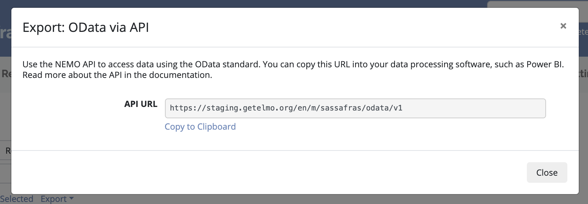

OData via API
=============
The API works with any external application that supports the OData standard (e.g. PowerBI, ArcGIS, Tableau.)

1. Click :guilabel:`Responses` menu
2. Click :guilabel:`Export` and select :guilabel:`OData via API`
3. Click :guilabel:`Copy to Clipboard` to copy the API url.
4. Paste the API url in any external application that supports OData.

