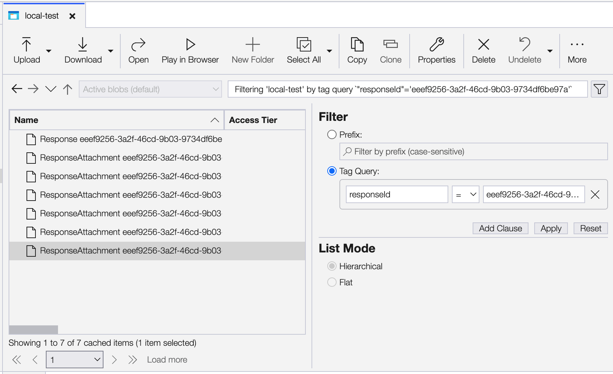
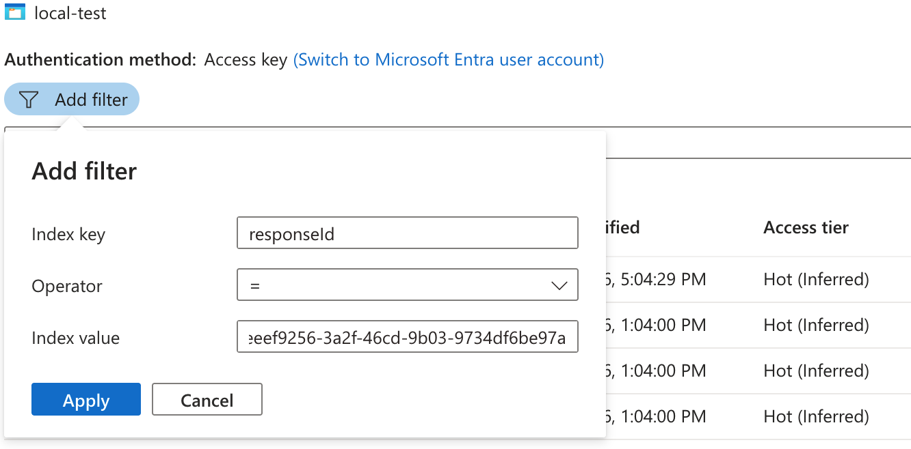
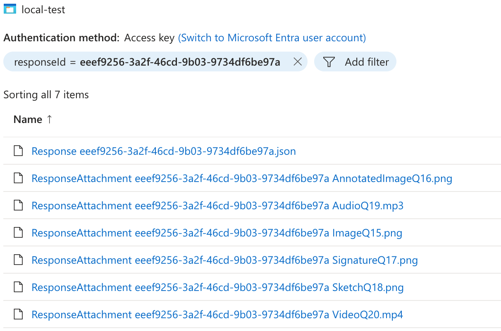

End-of-life archival
====================
During the lifecycle of any data collection mission, a team may wish to shut down a live NEMO instance (which can be costly to keep running) but preserve easy access to the collected data (which may be needed years later).

Server snapshots and database backups allow restoring a server later, but are not human readable and can still be costly to store for years. For this reason, NEMO has built-in archival scripts that allow archiving the server data to disk as human-readable files, and additional scripts that allow uploading that data to Azure Blob Storage with searchable `index tags <https://learn.microsoft.com/en-us/azure/storage/blobs/storage-manage-find-blobs>`_ that act as metadata. These files can be stored "hot" or "cold" in Azure depending on access frequency and budget.

Using these tags, it is possible to search for complex things such as **all responses associated with form X** or **all images uploaded by user X in response to form Y in March 2020**.

Initial archive
---------------
:Difficulty: Advanced. For server admins.

In the server's Rails console, run: ``Archiving::Exporter.new.export`` to export a zip file.

You may optionally use the additional flags ``Archiving::Exporter.new(relations: [], dont_implicitly_expand: []).export(skip: [], verbose: true)`` as documented in the code.

Initial upload
--------------
:Difficulty: Advanced. For server admins.

In the server's command line, ``unzip`` the archive you'd like to upload, then run: ``bundle exec rails azure_upload`` to upload the files while tagging them with metadata.

You may optionally use the env variables ``VERBOSE``, ``NEMO_AZURE_CONTAINER``, ``NEMO_AZURE_STORAGE_ACCOUNT_NAME``, and ``NEMO_AZURE_STORAGE_ACCESS_KEY`` as documented in the code.

Searching archives programmatically
-----------------------------------
:Difficulty: Advanced. For power users.

NEMO archives in Azure Blob Storage can be searched via the `az CLI <https://learn.microsoft.com/en-us/cli/azure/storage/blob>`_. A typical sequence of steps might look like:

1. Search for all files associated with a response (including the response itself + image attachments): ``az storage blob filter --account-name foo --container-name bar --tag-filter "responseId = 'abc-123'"``
2. Download a particular file: ``az storage blob download --account-name foo --container-name bar --name "Response abc-123.json" --file "optionally rename it.json"``
3. Download a batch of files: ``az storage blob download-batch --account-name foo --source bar --pattern "Response *.json" --destination "."``

Other relevant command examples include:

1. Log in before first use: ``az login``
2. Upload new/edited files if desired: ``az storage blob upload --account-name foo --container-name bar --tags responseId="abc-123" missionId="abc-123" --overwrite --file "Response abc-123.json"``

Searching archives using the Explorer app
-----------------------------------------
:Difficulty: Moderate. Allows bulk download.

NEMO archives in Azure Blob Storage can be searched via Azure's `Storage Explorer <https://azure.microsoft.com/en-us/products/storage/storage-explorer>`_ desktop app on Windows and Mac.

After logging in, click on your **Container**.

Then at the top right, click the funnel icon to expand the Filter menu:

The search results can be viewed or downloaded in bulk.

Searching archives online
-------------------------
:Difficulty: Easiest. Does not allow bulk download.

NEMO archives in Azure Blob Storage can be searched directly on Azure's website.

First navigate to your **Container** (within a **Storage Account**) to find the archive of all data.

Then you can either search by filename prefix using the search box, or click :guilabel:`Add filter` to search:

The search results can be viewed or downloaded individually:

Searchable values
-----------------

Regardless of what tool you use to search, the following **index tags** (also called metadata, though that word means something else in Azure) are searchable.

For example, to find **all images uploaded by user X in response to form Y in March 2020** you could filter by **entityType = responseAttachment AND login = foo AND formId = abc-123 AND createdAt >= 2020-03 AND createdAt < 2020-04**.

- All files:
    - createdAt (datetime string; refers to creation date within NEMO)
    - updatedAt (datetime string; refers to last modification within NEMO)
    - schemaVersion ("1"; unused but may be useful for future versioning)
- Mission:
    - entityType ("mission")
    - missionId (ID string)
- User:
    - entityType ("user")
    - userId (ID string)
    - login (username string)
- Assignment:
    - entityType ("mission-user assignment")
    - assignmentId (ID string)
    - missionId (ID string)
    - userId (ID string)
    - role (:ref:`user-roles` such as "enumerator")
- Form:
    - entityType ("form")
    - formId (ID string)
    - missionId (ID string)
- MediaPrompt:
    - entityType ("media prompt hint")
    - mediaPromptId (ID string)
    - questionCode (code string, for associated question)
    - missionId (ID string)
- Response:
    - entityType ("response")
    - responseId (ID string)
    - formId (ID string)
    - userId (ID string)
    - missionId (ID string)
- ResponseAttachment:
    - entityType ("response attachment")
    - responseId (ID string)
    - formId (ID string)
    - userId (ID string)
    - missionId (ID string)
