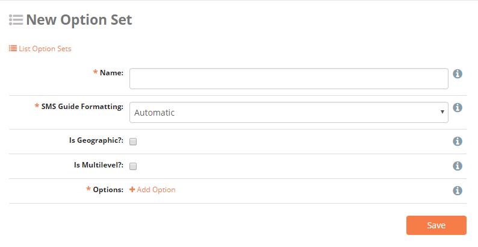
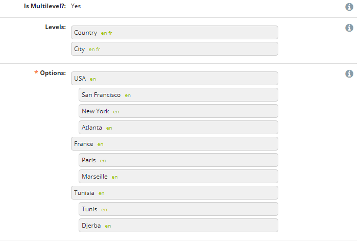
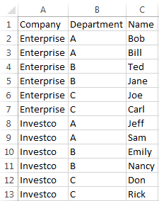
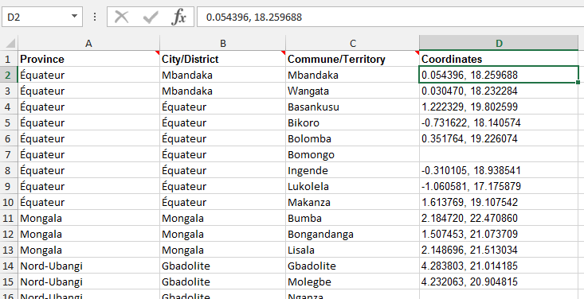
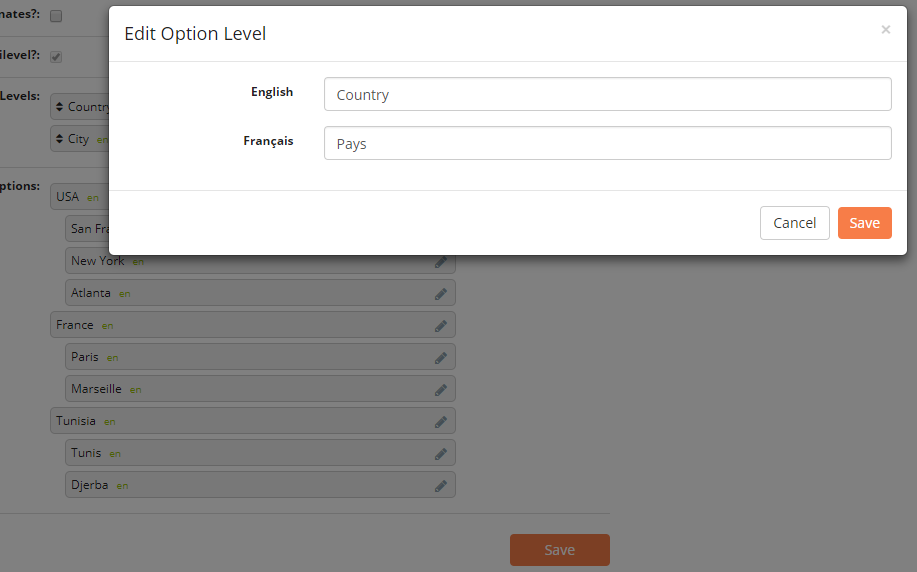

Option Sets
===========

The Option Sets page is where the answers for **Select One** and **Select Multiple** question types can be created. Click :guilabel:`Option Sets` on the menu bar to create or edit existing Option Sets.

Create new option set
---------------------

1. Click :guilabel:`Option Sets` menu.
2. Click :guilabel:`Create New Option Set`.

:guilabel:`Name` A unique name for the Option Set.

:guilabel:`Is Geographic?` Example, a set of provinces or regions. Responses that are geographic will appear on the map in the Dashboard. When checked, a new checkbox :guilabel:`With Coordinates?` is shown. If the options contain coordinates, check this box.

:guilabel:`Is Multilevel?` Check this box if you have :ref:`Multilevel`.

:guilabel:`Options` Click :guilabel:`Add Option` to add a new option.

.. _multilevel:

Multilevel options sets
-----------------------

Checking :guilabel:`Is Multilevel?` box allows the use of hierarchically organized options. Multilevel option sets can only be used for **Select One** questions.
Below is a classic example of countries and cities. Level 1 is **Country** and level 2 is **City**. The level 2 options needs to be indented compared to level 1 options. Drag and drop options to achieve the desired result.

Edit existing option set
------------------------

1. Click :guilabel:`Option Sets` menu.
2. Select the Option Set to edit by clicking :fa:`pencil`.
3. Click :guilabel:`Save`.

Import standard option set
--------------------------

1. Click :guilabel:`Import Standard Option Sets`.
2. Check the boxes next to the option sets to be imported.
3. Click :guilabel:`Import`.

Import new option set
---------------------

Option Sets can be created with spreadsheet software like Excel, and uploaded directly into NEMO:

1. Outside of NEMO, create a CSV or XLS file.
2. In the first row, include the name for each level as an individual column header (example Company \| Department \| Name ).

3. Add the names of the options.

4. In NEMO, click :guilabel:`Option Set` menu.
5. Click :guilabel:`Import New Option Set`.
6. Choose a name for the option set.
7. Choose the CSV or XLS file created in steps 1-3.
8. Click :guilabel:`Import`.

.. note::
  For large files, import can take some time. To see the status of the import go to **operations panel** by clicking on the link in the blue notice or going to https://yournemoinstance/en/operations .

Import option set with coordinates
----------------------------------

To upload an option set with coordinates:

1. Outside of NEMO, create a CSV or XLS file.
2. In the first row, include the name for each level as an individual column header with **Coordinates** as the last column (example: Province \| City \| District \| Coordinates ).
3. Add the names of the options.
4. In the column for **Coordinates**, include both latitude and longitude in decimal format separated by a comma (example 0.054396, 18.259688).

5. In the mission you are working on, click on the :guilabel:`Option Set` menu.
6. Click :guilabel:`Import New Option Set`.
7. Choose a Name for your option set.
8. Choose the CSV or XLS file you created.
9. Click :guilabel:`Import`.

Language translations
---------------------

Options within an Option Set can be translated in a manner similar to translating questions. To translate an option:

1. Create or edit an existing option set.
2. Click :fa:`pencil` next to the option to be translated.
3. Type the translation.
4. Click :guilabel:`Save`.

.. note::
  The two-letter language code for every translation appears next to the option name.

