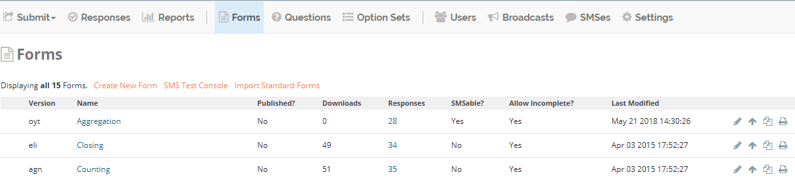
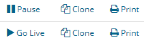
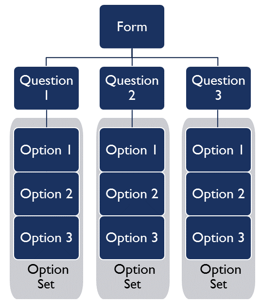
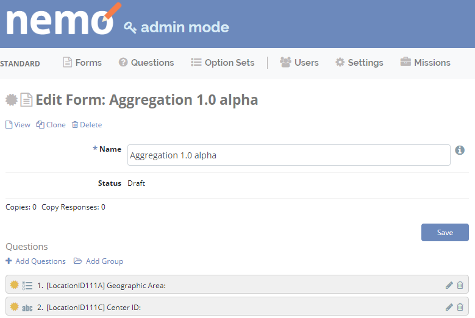
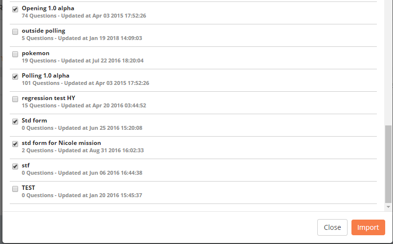
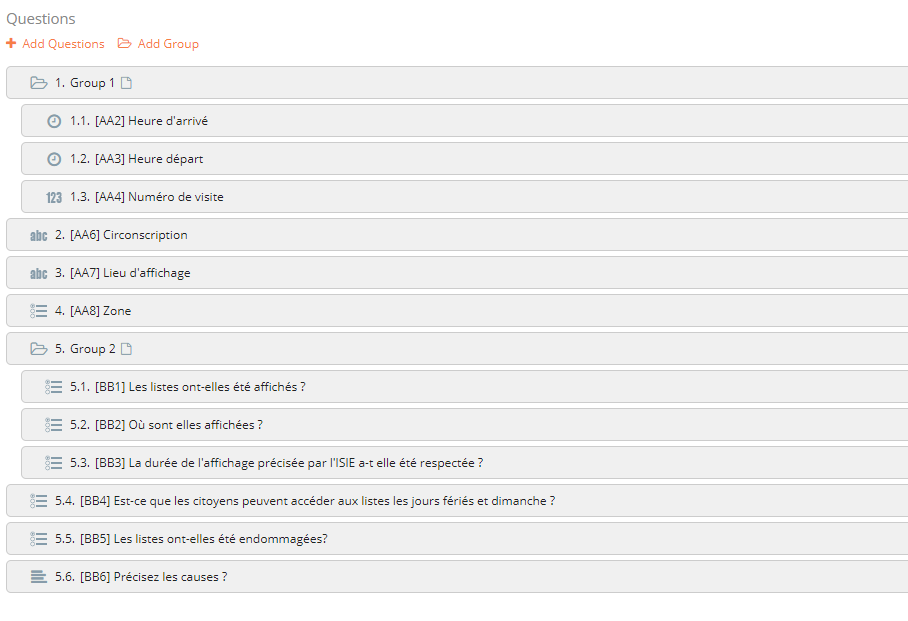
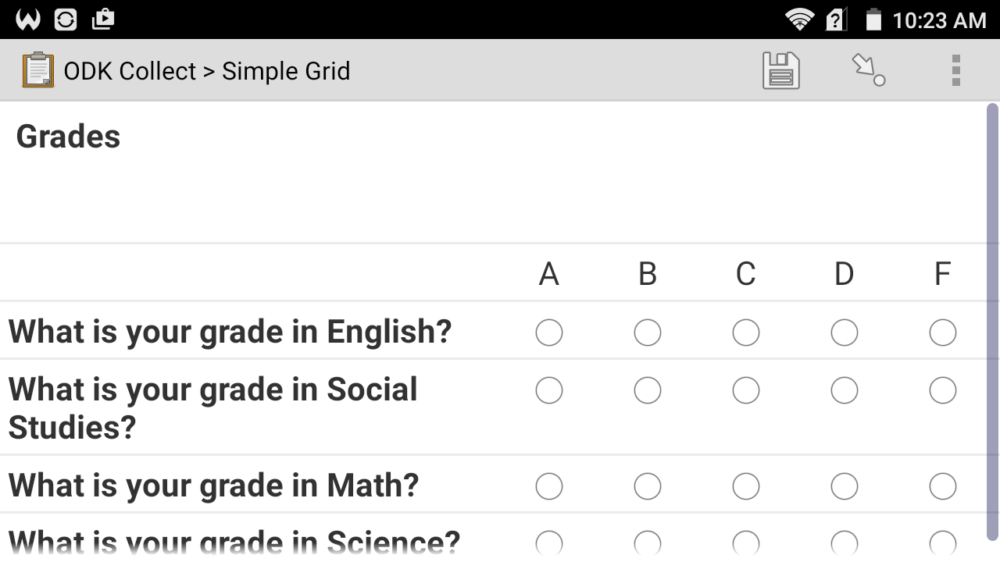
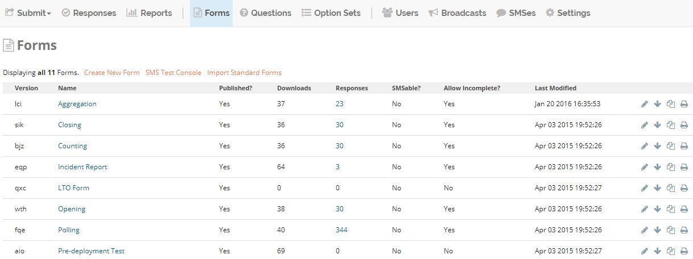

Forms
=====

Forms menu
----------

The **Forms** menu lists all the available forms for a mission. These are the components:

1. **Create New Form**: click to create a new form.
2. **SMS Test Console**: click to test form submission via SMS.
3. **Import Standard Forms**: click to import standard forms to the mission. These forms can be edited within the mission.

Once a form has been created, these components appear on the **Forms**
menu:

4.  **Version**: this column shows the version numbers of the forms that have been published.
5.  **Name**: this column shows the name of each form.
6.  **Questions**: this column shows the number of questions in each form.
7.  **Published?**: this column displays **Yes** if a form has been published, otherwise **No**.
8.  **Downloads**: this column shows the number of times each form has been downloaded.
9. **Responses**: this column shows the number of responses to each form that have been submitted.
10. **SMSable**?: this column displays **Yes** if a form can be submitted via SMS, otherwise **No**.
11. **Allow Incomplete?**: this column displays a **Yes** if a form allows incomplete submissions, otherwise **No**.
12. **Last Modified**: this column shows the date and the time that each form was last edited.

13. **Edit** icon: click this to edit the form in this row.
14. **Delete** icon: click this to delete the form in this row. This can only be done for forms that are unpublished.
15. **Publish** icon: click this to publish the form in this row. This can only be done for forms that are unpublished.
16. **Unpublish** icon: click this to unpublish the form in this row. This can only be done for forms that are published.
17. **Clone** icon: click this to create an identical copy of the form in this row.
18. **Print** icon: click this to print the form in this row.

In Admin Mode, the **Forms** menu only contains the following components:

- **Create New Form**
- **Name**
- **Questions**
- **Copies**: this column shows the number of missions each form has been imported to.
- **Copy Responses**: this column shows the number of responses to each form that have been submitted across all.
- **Last Modified**
- **Edit** icon
- **Delete** icon
- **Clone** icon
- **Print** icon

Overall structure of forms
--------------------------

Building a new form involves the following steps:

- Create a new form or import a standard form.
- Create new questions or add existing questions to the form.
- If the question has options, create option sets for those question.

Creating a standard form
------------------------

Forms, questions, and option sets created in **Admin Mode** can be reused in multiple missions. If the Admin Mode link does not appear on the screen, permission is not granted to create standard forms.

1. Click :guilabel:`Admin Mode`.
2. Click the :guilabel:`Forms` menu.
3. Click :guilabel:`Create New Form`.
4. Type a name for the form in the text box.
5. Click :guilabel:`Save`.

    .. image:: create-standard-form.png
      :alt: Create standard form 

6. Click :guilabel:`Add Questions` to add questions to the form.
7. To create a group of questions, click :guilabel:`Add Group`.
8. Click :guilabel:`Save`.

Creating a general form
-----------------------

**To create a new Form**:

1. Go to the forms page by clicking on the :guilabel:`Forms` menu.
2. Click the :guilabel:`Create New Form` link.
3. Type a name for the form in the text box.

.. note::

  By clicking on :guilabel:`More Settings` you can:

  - Set a **Default Response Name** for the form.
  - Check the :guilabel:`Allow Incomplete` box to allow forms to be submitted without required questions filled in.
  - Check the :guilabel:`SMSable` box if you want to be able to receive responses to the form via SMS. If checked you can also:

    - Check :guilabel:`SMS Forwarding?` if you want to forward incoming SMS responses to a user or a group of user.
    - Check :guilabel:`Authenticate SMS?:` if you want only authenticated users to send SMS responses.

**To add questions to the Form**:

1. Click :guilabel:`Add Questions`.

  - Select from existing questions in the question bank.
  - Or create a new question to add to the Form (see :doc:`../formsquestions/formsquestions` section below for detailed instructions).

2. Click :guilabel:`Save` when finished editing.

Importing standard forms
------------------------

To import a Standard Form:

1. Go to the :guilabel:`Forms` menu in the mission.
2. Click :guilabel:`Import Standard Forms`.
3. Check the boxes next to the forms you want to import.
4. Click :guilabel:`Import`.

Creating groups and grids
-------------------------

Groups
~~~~~~

Grouping questions by context makes it easier for users to fill forms. On **ODK Collect** (Elmo Android app) group questions will show on the same page.

.. note::

  - Groups cannot be placed within questions or other groups.
  - Groups cannot be made conditional or hold both `conditional questions <../formsquestions/formsquestions.html>`__ and the questions that trigger them.

**To create a group**:

1. Create or edit an existing form.
2. Create or add questions to the form.
3. Create at least one group.

   a. Click :guilabel:`Add Group`.
   b. Give the group a unique name.
   c. Click :guilabel:`Save`.

4. Click and drag the questions in the desired order of appearance.
5. Click and drag groups in the desired order of appearance.
6. Drag questions intended for groups to the right so that they appear indented in relation to the group.
7. Click :guilabel:`Save` to save the form, or click :guilabel:`Save and Publish` if the form is ready to be used.

Grids
~~~~~

Groups can be used to create grids, an example of which is shown below.

Grids can only be created under certain conditions:

- Questions must be in the same group.
- Questions must be of **Select One** type.
- Questions must have the same option set.

**To create a grid**:

1. Create or edit an existing form.
2. Create or edit an existing group.
3. Place **Select One** questions with the same option set in the group.
4. Click :guilabel:`Save` to save the form, or click :guilabel:`Save and Publish` if the form is ready to be used.

Publishing a form
-----------------

Once a form has been created, it must be published before users can submit responses. To publish a form:

1. Click :guilabel:`Forms` menu.
2. On the right side of the page, click :fa:`arrow-up` located on the same line as the form to publish. If the arrow is down :fa:`arrow-down` the form is already published.

Printing forms
--------------

To print a hardcopy of a form:

1. Click :guilabel:`Forms` menu.
2. Select a form from the list.
3. Click :guilabel:`Print Form`.
