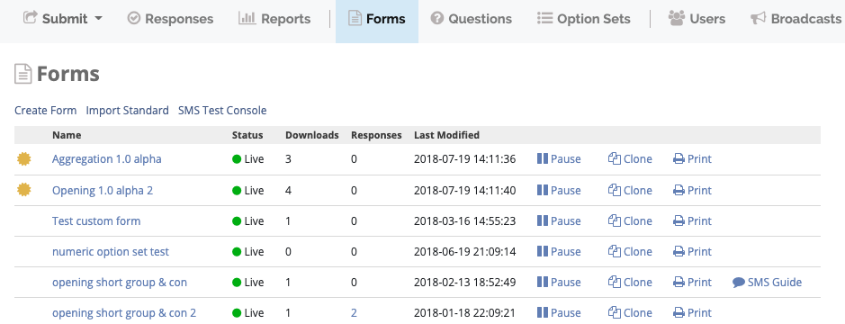
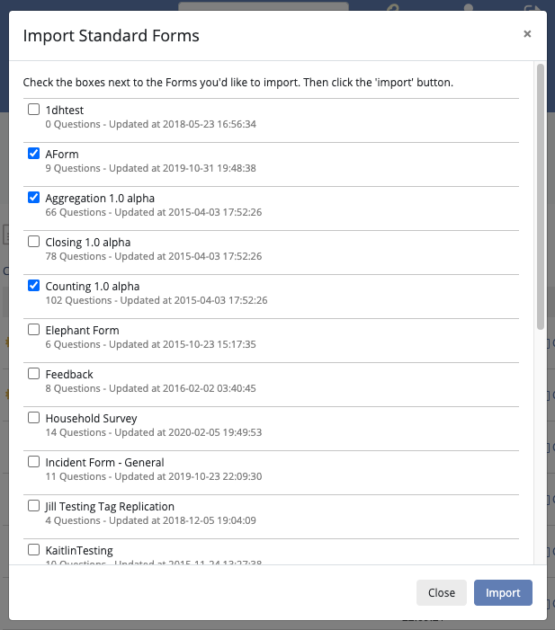

.. HTML line break definition
.. |br| raw:: html

    

Forms
=====

Forms menu
----------

The **Forms** menu lists all the available forms for a mission.

:guilabel:`Create New Form` Click to :ref:`create-general-form`. |br|
:guilabel:`SMS Test Console` Click to test form submission via SMS. |br|
:guilabel:`Import Standard Forms` Click to :ref:`import-standard-forms` to the mission. These forms can be edited within the mission.

Form status
~~~~~~~~~~~~

Forms have 3 different status:

- **Live**: form is available for enumerators to download and submit responses. Only minor changes to the form are permitted like form name, question title and hints.
- **Paused**: form is not available for enumerators to download and submit responses. Only minor changes to the form are permitted like form name, question title and hints.
- **Draft**: form is not available for enumerators to download and all changes are permitted.

Action icons
~~~~~~~~~~~~

For every form in the list, action icons are in the right and work as follows:

:fa:`pause` Pause form. Changes the form status to paused. |br|
:fa:`play` Go live. Changes the form status to live. |br|
:fa:`copy` Clone. Click to create an identical copy of the form. |br|
:fa:`print` Print. Click to print the form. |br|

.. _create-general-form:

Create a general form
-----------------------

**To create a new Form**:

1. Click :guilabel:`Forms` menu.
2. Click :guilabel:`Create New Form`.
3. Type a name for the form in the text box.

.. note::

  By clicking on :guilabel:`More Settings` you can:

  - Set a **Default Response Name** for the form.
  - Check the :guilabel:`Allow Incomplete` box to allow forms to be submitted without required questions filled in.
  - Check the :guilabel:`SMSable` box if you want to be able to receive responses to the form via SMS. For more information check :ref:`smsable`.

**To add questions to the Form**:

1. Click :guilabel:`+ Add Questions`.

  - Select from existing questions in the question bank.
  - Or create a new question to add to the Form (see :doc:`../formsquestions/formsquestions` section below for detailed instructions).

2. Click :guilabel:`Save` when finished editing.

Create a standard form
------------------------

Forms, questions, and option sets created in **Admin Mode** can be reused in multiple missions. If the Admin Mode link does not appear on the screen, permission is not granted to create standard forms.

1. Click :guilabel:`Admin Mode`.
2. Click :guilabel:`Forms` menu.
3. Click :guilabel:`Create New Form`.
4. Type a name for the form in the text box.
5. Click :guilabel:`Save`.

    .. image:: create-standard-form.png
      :alt: Create standard form 

6. Click :guilabel:`+ Add Questions` to add questions to the form.
7. To create a group of questions, click :guilabel:`Add Group`.
8. Click :guilabel:`Save`.

.. _import-standard-forms:

Import standard forms
------------------------

To import a Standard Form:

1. Click :guilabel:`Forms` menu.
2. Click :guilabel:`Import Standard Forms`.
3. Check the boxes next to the forms you want to import.
4. Click :guilabel:`Import`.

Create groups and grids
-------------------------

Groups
~~~~~~

Grouping questions by context makes it easier for users to fill forms. Groups cannot be placed within questions or other groups.

**To create a group**:

1. Create or edit an existing form.
2. Create or add questions to the form.
3. Create at least one group.

  a. Click :guilabel:`Add Group`.
  b. Give the group a unique name.
  c. If you want to make the group of questions repeatable, check the box :guilabel:`Repeatable?`. Example: if entering details of multiple family members in a household.
  d. If you want to show the group of questions in the same screen in ODK Collect, check :guilabel:`Show on One Screen`.
  e. Choose the Display Logic.

    - Always display this group.
    - Display this group if all of these conditions are met.
    - Display this group if any of these conditions are met.
   
  f. Click :guilabel:`Save`.

4. Click and drag the questions in the desired order of appearance.
5. Click and drag groups in the desired order of appearance.
6. Drag questions intended for groups to the right so that they appear indented in relation to the group.
7. Click :guilabel:`Save` to save the form, or click :guilabel:`Save and Go Live` if the form is ready to be used.

Grids
~~~~~

Groups can be used to create grids in ODK Collect, example:

.. note::

  Grids can only be created under certain conditions:

  - Questions must be in the same group.
  - Questions must be of **Select One** type.
  - Questions must have the same option set.

**To create a grid**:

1. Create or edit an existing form.
2. Create or edit an existing group.
3. Place **Select One** questions with the same option set in the group.
4. Click :guilabel:`Save` to save the form, or click :guilabel:`Save and Go Live` if the form is ready to be used.

²
Go live
-------

Once a form has been created, it must go live before users can submit responses. you can do so when editing a form by:

 - Clicking :fa:`play` Go Live on the top of the screen.
 - Or clicking :guilabel:`Save and Go Live` button.

You can also Go Live from the forms list menu by clicking :fa:`play` Go Live:

Form version
-------------

Each form version has a 10 digit ID and a 3 letters code (example: 2019092500-oyt). The form versioning system is intended to indicate small changes in the form design so that enumerators can update their copies of the form.

When editing a form, click :guilabel:`Increment Version` to increment the form version.

You can also choose the minimum accepted version of the form, to do so click :guilabel:`More settings` then :guilabel:`Minimum Accepted Version`

Print form
--------------

To print a hardcopy of a form:

1. Click :guilabel:`Forms` menu.
2. Select a form from the list.
3. Click :guilabel:`Print`.
4. A dialog will show up saying that you need to activate background colors and images. Click :guilabel:`OK` then activate these in your system/browser print options.