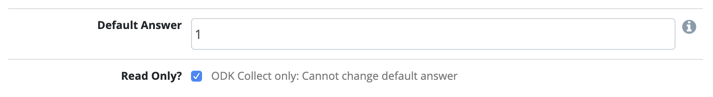

Questions
=========

Create a question
-----------------

To create a question:

1. Click :guilabel:`Questions` in the menu bar.
2. Click :guilabel:`Create New Question`.

.. image:: create-question.png
  :alt: create question

:guilabel:`Code`
   A unique name for the question.

:guilabel:`Type`
  Type of the question. More details can be found in :ref:`question-types` section.

:guilabel:`Title`
  Title of the question.

:guilabel:`Hint`
  Further instructions for the question. More details can be found in :ref:`hints` section.

:guilabel:`Is Key Question`
  Answers to key questions help summarize responses and appear in the response listing. If this box is marked, a column showing these answers will be added in the Responses tab.

:guilabel:`Tags`
  Add :ref:`tags` to this question.

.. _question-types:

Import new questions
--------------------
Upload a CSV to import questions. Importing from a CSV is very useful for questions with many translations.

1. Click :guilabel:`Questions` in the menu bar.

2. Click :guilabel:`Import from CSV`
3. Click the :guilabel:`CSV template` link to download a CSV template to use in Excel or other spreadsheet software. Note that the file you upload must be CSV format.
4. Upload the completed CSV file (description of columns below) and click :guilabel:`Import`.

The format of the CSV columns are as follows:

+------+-------+-----------------+-----------+----------+-----------+-----------+
| Code | QType | Option Set Name | Title[en] | Hint[en] | Title[fr] | Hint[fr]  |
+------+-------+-----------------+-----------+----------+-----------+-----------+

* :guilabel:`Code` Code must be a short codename (between 2-20 characters). Should contain only letters and numbers, e.g. BallotBoxSealed, DepartTime.
* :guilabel:`QType` The question type. The question types that are supported for importing questions are the following (must follow underscore case):
  integer, select_one, select_multiple, text, long_text, decimal
* :guilabel:`Option Set Name` If using a select_one or select_multiple question type, include an existing option set name.
* :guilabel:`Title[en]` The title of the question in English or the default language of the mission. "en" represents the language code. Supported languages can be found in the mission settings where you can add or edit existing languages.
* :guilabel:`Hint[en]` The hint of the question in English or the default language of the mission. Hints are optional.
* :guilabel:`Title[fr]` Any additional languages that you would like to add (in this case French), should alternate with title and hints with the language shortcode in brackets. You can find view what languages are supported or add additional ones in the Mission settings.

Types of questions
------------------

.. list-table::
   :widths: auto
   :header-rows: 1

   * - Type
     - Description
   * - Text
     - Short text that shows in a single line of input.
   * - Long Text
     - Long text that shows in multiple lines of input.
   * - Integer
     - Numeric answer that must be a whole number without decimals.
   * - Decimal
     - Numeric answer that allows for decimals.
   * - Location
     - GPS location of the user.
   * - Select One
     - Only one answer can be selected from a multiple choice option set.
   * - Select Multiple
     - Multiple answers can be selected from a multiple choice option set.
   * - Date/Time
     - Enter both date and time.
   * - Date
     - Date only field.
   * - Time
     - Time only field.
   * - Image
     - The image should be at most 5MB. Accepted formats are: jpg, png.
   * - Annotated Image
     - The image should be at most 5MB. Accepted formats are: jpg, png. You can add markup to the image.
   * - Signature
     - Sign with a finger in ODK Collect or upload a signature image in NEMO.
   * - Sketch
     - Sketch an image with a finger.
   * - Barcode
     - Scan a barcode with ODK Collect.
   * - Audio
     - Record or select a sound from your device. File size should be at most 10MB. Accepted formats are: mp3, ogg, webm, wav.
   * - Video
     - Record or select a video from your device. File size should be at most 10MB. Accepted formats are: 3gp, mp4, webm, mpg, wmv, avi.

.. _hints:

Hints
-----

Hints are optional help texts used to provide additional instructions on the question.

- On NEMO desktop, click :fa:`info-circle` on the right of the question to see the hint.
- On ODK Collect (NEMO Android app), the hint will be shown below the question as follows:

.. image:: hint-android.png
  :alt: hint Android

Read-Only
--------------

The NEMO development team is working on a read-only question type. In the meantime, you can
still create read-only text on your form (ODK forms only). To create read-only text:

- Create a :guilabel:`Text` question.
- Enter the read-only text in the question's :guilabel:`Title`.
- Enter a :guilabel:`Default value` (value does not matter, as it will be read-only).
- Select the :guilabel:`Read-only` option. The read-only option will only appear if there is a default value.

Language translations
---------------------

Question titles and hints can be translated into any language that has
been set for the mission. To add a language to a mission, go to :guilabel:`Settings` menu and edit :guilabel:`Preferred Languages`.

.. image:: preferred-languages-enfr.png
   :alt: preferred languages

When editing a question. Title and Hint will show up for selected languages:

.. image:: title-hint-enfr.png
   :alt: title hint

.. note::

  To view the translation, change the language by clicking :guilabel:`Change Language` in the footer. For example, the French translation of an English question will appear once French is selected.

.. _tags:

Tags
----

Tags are an easy way to organize information around a common keyword or
theme. In NEMO, questions may be tagged with keywords or descriptors,
which may be used to find all of the questions with the same tag. Tags
are also used in Reports to help sort information assigned to questions.

To tag questions:

1. Open or create the question you wish to tag.
2. Type in the :guilabel:`Tags` box and click :guilabel:`Enter` to add a tag.

.. note::

  - You can add multiple tags.
  - To delete a tag, click :fa:`times` next to the tag.

3. Click :guilabel:`Save` after adding tags to save your changes.

Metadata type
-------------

Metadata type is a special value that can be pre-filled into a question. If chosen the question will be automatically hidden and not required, and any conditions will be removed.
For now the Metadata is only available for Date/Time question type.

1. Create a new Date/Time question.
2. Click the :guilabel:`Metadata Type` dropdown.
3. Select the Metadata you want to record.

.. note::

  - Form Start Time: will record the time Enumerator started the form.
  - From End Time: will record the time Enumerator ended the form.

Advanced options
----------------
The following features are only available for questions that are added to form.

Display logic
^^^^^^^^^^^^^
By default all questions are shown in the form. Display logic controls which question to show depending on conditions.

.. image :: display-logic.png
  :alt: Display logic

To edit display logic:

1. Click :guilabel:`Forms` menu.
2. Click :fa:`pencil` next to the form you want to edit.
3. Click on the :guilabel:`Question` you want to edit.
4. Click on the display logic dropdown :fa:`caret-down` and choose between three options:

  - Always display this question.
  - Display this question if all of these conditions are met.
  - Display this question if any of these conditions are met.

.. note::

  - Click :guilabel:`+ Add Condition` if you want to add another condition for the same question.
  - If you would like to use advanced expressions such as XPath, you should use default answer to perform the calculation, and then use display logic on a separate question. See Default answer and XPath Expressions below.

Skip logic
^^^^^^^^^^

On ODK Collect (NEMO Android app), by default when you swipe left or click :fa:`arrow-right` you will be redirected to the following question in the form. With the skip logic you can go to any question on the form if conditions are met.

To edit skip logic:

1. Click :guilabel:`Forms` menu.
2. Select a form from the list and click :fa:`pencil`.
3. Click on the :guilabel:`Question` you want to edit.
4. Click on skip logic dropdown :fa:`caret-down` and select :guilabel:`After this question, skip ...`.
5. Choose the destination and conditions to be met.

.. image :: skip-logic.png
  :alt: Skip logic

Constraints
^^^^^^^^^^^

Constraints are conditions that must be met in order for an answer to be accepted. This feature is only available on the mobile app **ODK Collect**.

To edit constraints:

1. Click :guilabel:`Forms` menu.
2. Select a form from the list and click :fa:`pencil`.
3. Click on the :guilabel:`Question` you want to edit.
4. Click on constraints dropdown :fa:`caret-down` and select :guilabel:`Only accept an answer if ...`.
5. Select the conditions and rules to be met.

.. image :: constraints.png
  :alt: Constraints

.. note::
  - Constraints can only be added on previous questions.
  - When editing an Integer question type you can also add a constraint about the :guilabel:`Minimum` and :guilabel:`Maximum` value.

  .. _defaultanswer:

Default answer
^^^^^^^^^^^^^^

Text entered here will be pre-filled in the answer space (for ODK Collect only).

Previous answers:
You can enter a ``$QuestionCode`` to include the value of a previous question.
If the question has an option set and has values assigned to each option, you can use ``$QuestionCode:value`` to get the value of the answer.
You can use the value to calculate a sum or average of the answers over multiple questions.
Both of these types of expressions must be wrapped in a calc(). See the XPath expression section below for examples.

Repeat groups:
When using repeat groups, you can access the number of the current item in the repeat group by using ``$!RepeatNum``

For example, entering ID: ``$Household-$!RepeatNum`` would pre-fill the answer with ID: 176-2 for the second person in household 176,
assuming you have a question with code 'Household'.

You can also enter an XPath expression by wrapping it with calc(). See the XPath expressions section below.

Required, hidden, and disabled options
^^^^^^^^^^^^^^^^^^^^^^^^^^^^^^^^^^^^^^

- *Required*: Check :guilabel:`Required?` box to make this question required. Form cannot be submitted if not answered, unless an override code is provided.
- *Hidden*: Check :guilabel:`Hidden?` to hide question on the form but still collect default answer (ODK Collect only). For web and SMS forms, the question will behave as if disabled.
- *Disabled*: Check :guilabel:`Disabled?` to hide the question and not collect anything.

.. _xpath:

XPath expressions
^^^^^^^^^^^^^^^^^
An XPath expression is a function, operator, or value from previous responses that are dynamically generated as the form is filled out.
XPath is a query language used to perform operations on XLSForms (the form standard that ODK Collect uses). Currently, only the default answer field on a question supports XPath expressions when used with ODK Collect.
All XPath expressions must be wrapped in a calc() function in a question's default answer field.

Example ``calc(($likert1:value * 2) + $likert2:value)``

All XPath expressions supported by ODK should be supported by NEMO.
This includes boolean logic, string parsing, and number functions.
Details on XPath operators (math and logic) can be found `here <https://docs.getodk.org/form-operators-functions/>`__.
Complete documentation on XPath functions can be found `here <https://getodk.github.io/xforms-spec/#xpath-functions>`__.

**Common Scenarios**

*Conditionally display intervention*

I want to display an intervention only if the sum of 2 likert questions is greater than 10.

1. Create Likert questions and an option set with values set as a number.
2. Create a question that calculates the score (e.g. put ``calc($likert1:value + $likert2:value)`` in the default answer.)
3. Create the intervention question and use display logic to only show the question if the default answer is > 2.

*Using a Counter*

While NEMO does not explicitly have a counter question type, you can access the number of an item within a repeat group.
For example, you could put ``calc($Household-$!RepeatNum)`` in a default answer for a question. The answer would be with ID: 176-2 for the second person in household 176,
assuming you have a question with code 'Household'.

*Generate a Random String*

I want to generate a random string to be associated with a response.

1. Create a text question and put ``calc(uuid(8))`` in the default answer. The number parameter is the length of the string you wish to generate.
