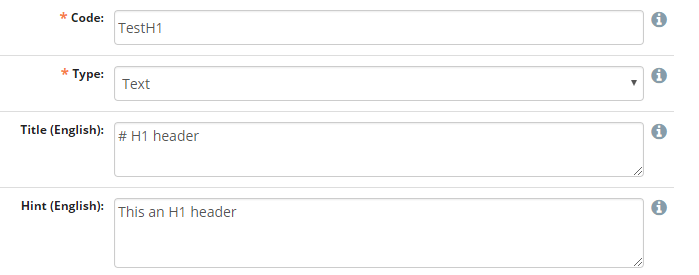
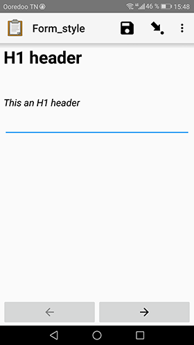
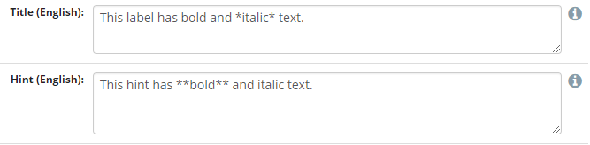
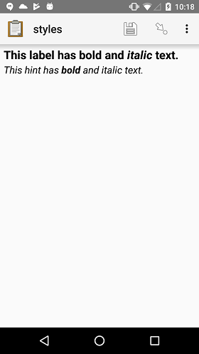
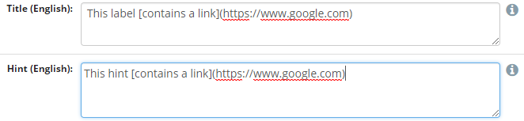
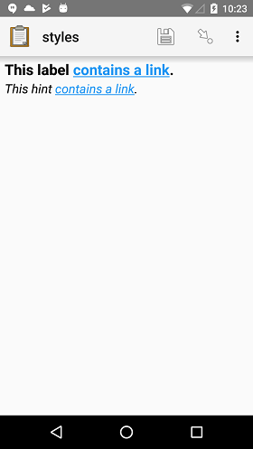
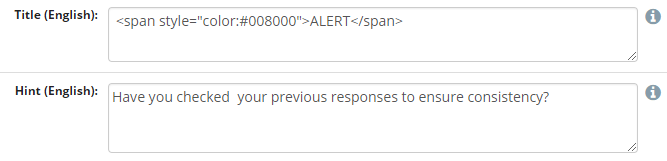
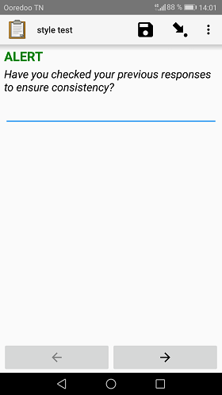
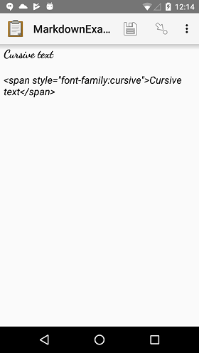
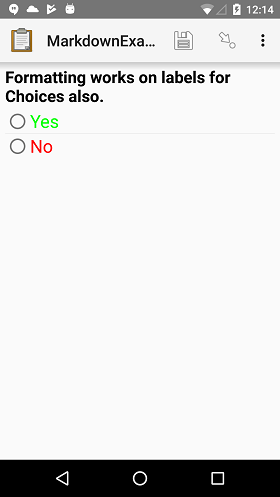

Form Styling
============

Titles, hints, and option sets can all be styled using Markdown, fonts and colors.

Markdown
--------

Headers
~~~~~~~~
Titles and hints can be styled with one of six header levels.

.. code-block:: none

  # Header H1
  
  ## Header H2
  
  ### Header H3
  
  #### Header H4
  
  ##### Header H5
  
  ###### Header H6

This is an example of how an H1 Header is set in NEMO/ELMO:

And this is how it looks like in ODK Collect

Emphasis
~~~~~~~~
ODK Collect's Markdown support also includes **bold** and *italic* styling.

.. code-block:: none

  _italic_

  *italic*

  __bold__

  **bold**

.. note::

  The label of a form widget is already bold, so bolding text within the label has no effect.
  Similarly, the hint text of a form widget is already in italics, so italicizing text within the hint has no effect.

Example:

And the result in ODK Collect:

Hyperlinks
~~~~~~~~~~~
  
hyperlinks are also supported. When clicked they will open in the device's default browser. Below is the syntax:

.. code-block:: none

  [Link anchor text](link.url)
  

Example:

And the result in ODK Collect:

Fonts and colors
---------------------

Use the `style <https://developer.mozilla.org/en-US/docs/Web/HTML/Global_attributes/style>`_ attribute on a ```` tag to add custom ``color`` and ``font-family``.

- For ``color``, try one of the `named HTML color values`_ or use a `hex color`_.
- For ``font-family``, it is best to use `generic font categories`_
  rather than specific fonts:
  
  - serif
  - sans-serif
  - monospace
  - cursive
  - fantasy
  
  This will ensure support across most devices. You can also use specific font choices, but you should test these on the actual devices being used.

.. _named HTML color values: https://html-color-codes.info/color-names/
.. _hex color: http://www.color-hex.com/
.. _generic font categories: https://developer.mozilla.org/en-US/docs/Web/CSS/font-family#%3Cgeneric-name%3E

.. note::

   These two attributes, ``color`` and ``font-family``, are the only style attributes supported in Collect.

Example:

And the result in ODK Collect:

Font family example:

Option set example:

.. note:: 

  This document is a derivative of the original `Form Styling <https://docs.opendatakit.org/form-styling/>`_ licensed under a Creative Commons Attribution 4.0 International License.