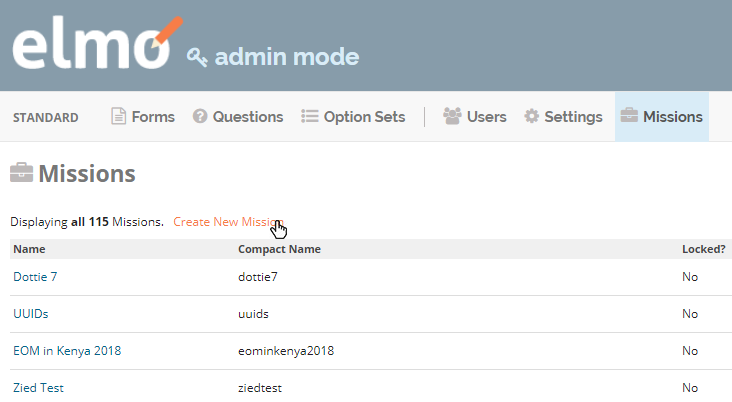
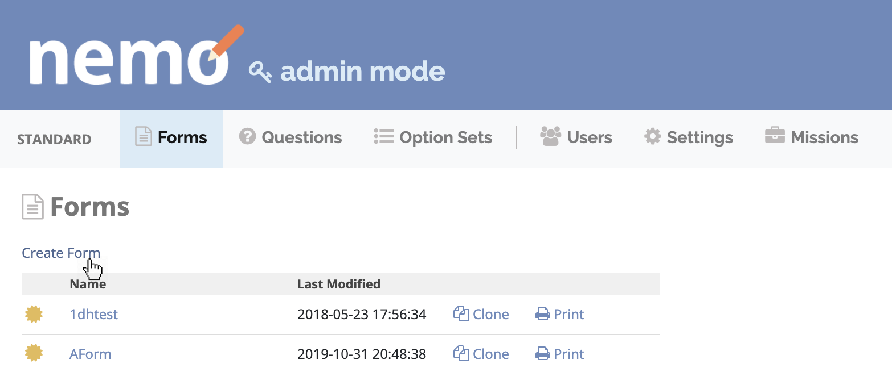
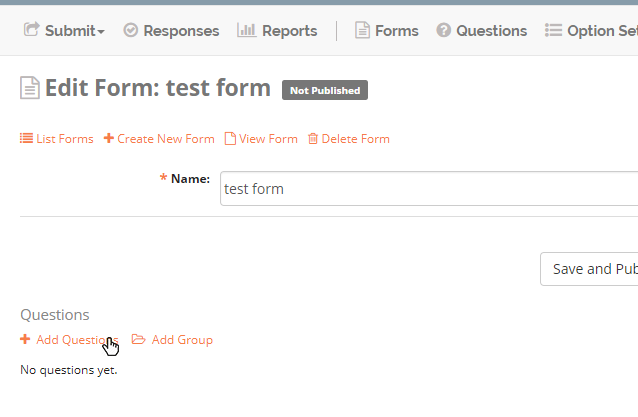
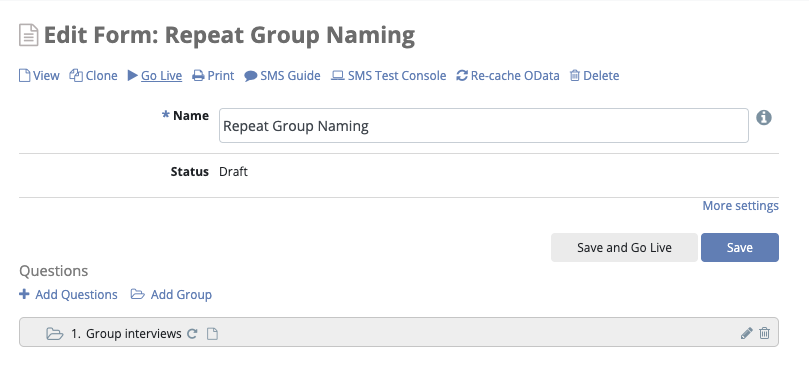
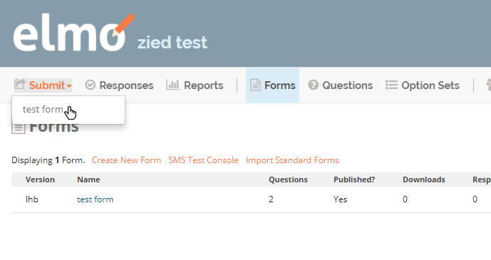

Getting Started
~~~~~~~~~~~~~~~

Below are the steps required to create a new mission (Admin access required), create a new form, add question to the form, then deploy the form.

Create a Mission
"""""""""""""""""

.. note::
  Only Admin users can create missions

1. Click **admin mode** on the top right
2. Enter **Missions** tab
3. Click on **Create New Mission**

.. tip::
  * Mission names usually include the country name and the year (i.e. Kenya 2013)
  * Administrators have the option to lock a mission. When a mission is locked, Responses and Forms cannot be created or edited, and users cannot be added or deleted. To lock a mission, click the box labeled **Locked?**

Create a New Form
"""""""""""""""""

1. Exit admin mode and tap on the **Forms** tab
2. Click **Create New Form** to create your first form

Add Questions to Form
"""""""""""""""""""""

Click on **+ Add Question**

.. tip::
  For more details on question types go to :ref:`question-types` section
  

Publish Form
"""""""""""""""""

After adding questions to your form, you need to **publish** the form in order to allow users to submit form responses. To do so Click on **Publish Form**

Submit Response
"""""""""""""""""

Now you are ready to submit form responses:

1. Click on the **Submit** tab
2. Select a form from the list

