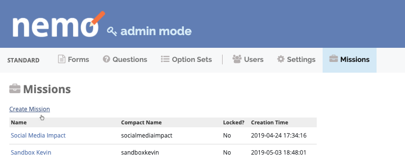

Getting Started
===============

Below are the steps required to create a new mission (Admin access required), create a new form, add question to the form, then deploy the form.

Create a mission
----------------

.. note::
  Only Admin users can create missions.

1. Click :guilabel:`Admin Mode` on the top right.
2. Click on :guilabel:`Missions` tab.
3. Click on :guilabel:`Create New Mission`.

.. tip::
  - Mission names usually include the country name and the year (i.e. Kenya 2013).
  - Administrators have the option to lock a mission. When a mission is locked, responses and forms cannot be created or edited, and users cannot be added or deleted. To lock a mission, edit the mission and check the box labeled :guilabel:`Locked`.

Create a new form
-----------------

1. Exit Admin Mode and click on the :guilabel:`Forms` tab.
2. Click :guilabel:`Create New Form` to create your first form.

Add questions to form
---------------------

Click on :guilabel:`+ Add Question`.

.. image:: addquestion.png

.. tip::
  For more details on question types go to :ref:`question-types` section.
  

Publish form
------------

After adding questions to your form, you need to **publish** the form in order to allow users to submit form responses. To do so click on :guilabel:`Publish Form`.

Submit response
---------------

Form responses can be submitted in three different ways:

- On the :doc:`../submitonline/submitonline`.
- Using the mobile application with :doc:`../submittablet/submittablet`.
- Via :doc:`../submitsms/submitsms`.
