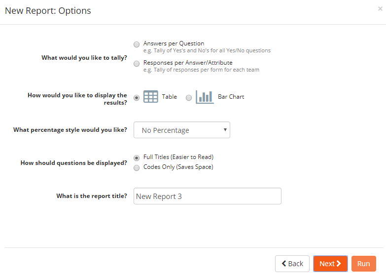
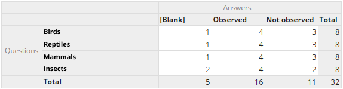
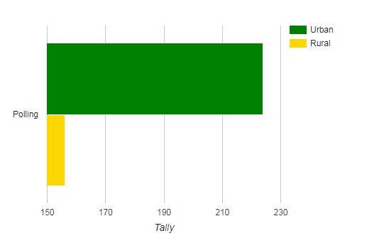
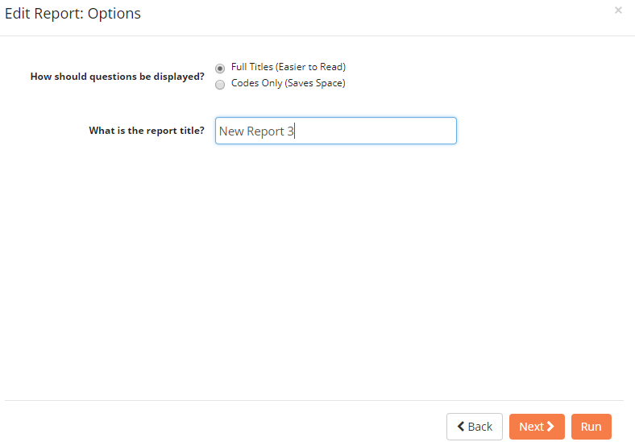
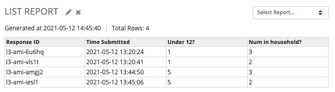
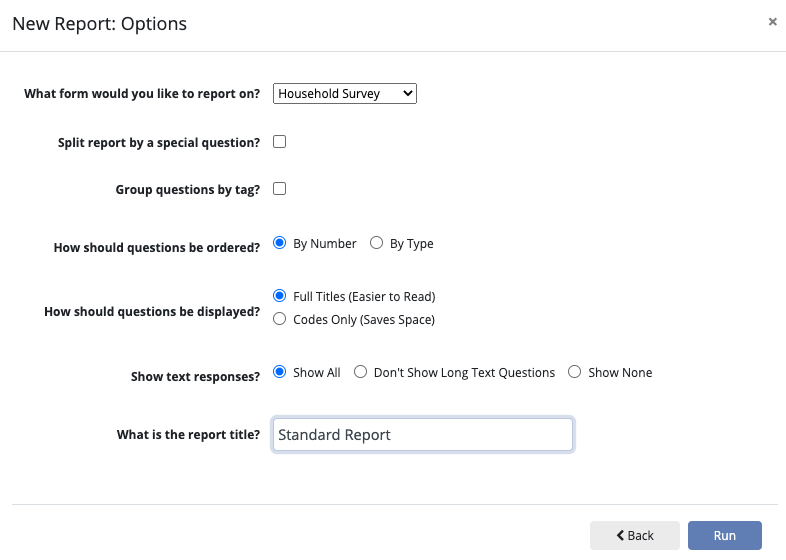
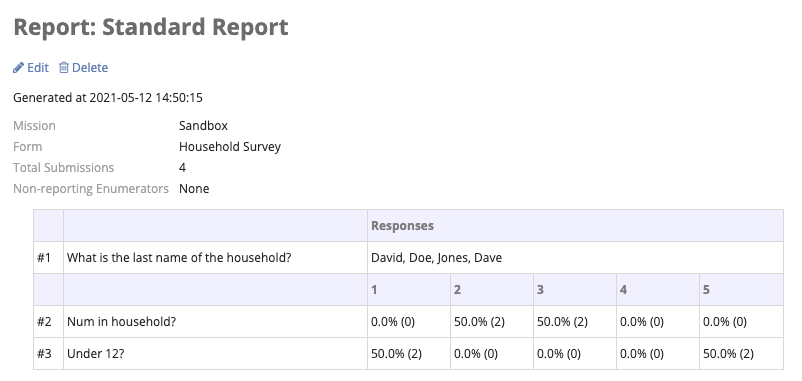

Reporting and Data Analysis
===========================

Internal report building
------------------------

Submitted data can be visualized in the reports section of NEMO. Enumerators are only able to generate reports
from their own submitted responses. Reviewers, staffers, coordinators and admins can generate reports from data submitted by all users.

To create a new report:

1. Click :guilabel:`Reports` menu.
2. Click :guilabel:`Create New Report`.

Tally report
~~~~~~~~~~~~

Shows Aggregated tallies of answers or responses, grouped by attributes of interest. If selected, the following prompts/options are available:

1. Select how you would like to tally.
2. Choose between :guilabel:`Table` or :guilabel:`Bar Chart` results display.
3. Select :guilabel:`How should questions be displayed`.
4. Type a name for the report.
5. Click :guilabel:`Next`.
6. Select the forms you want to include in your report then click :guilabel:`Next`.
7. Select the questions for row headers.
8. If needed, select the questions for column headers.
9. Click :guilabel:`Run`.

**Example of answers per question Table display**

**Example of responses per answer/attribute Bar chart**

List report
~~~~~~~~~~~~

A raw listing of answers and attributes for a set of responses. If selected, the following prompts/options are available:

1. Select :guilabel:`How should questions be displayed`.
2. Type a name for the report.
3. Click :guilabel:`Next`.
4. Select the forms you want to include in your report then click :guilabel:`Next`.
5. Select the columns you want to include then click :guilabel:`Run`.

Example:

Standard report
~~~~~~~~~~~~~~~~

A question-by-question summary of the responses for a specific form. The purpose of this report is to help give a ready-made overview of responses for a specific questionnaire. If selected, the following prompts/options are available:

1. Select the form you would like to report on.
2. If needed, check :guilabel:`Split report by a special question`.
3. If needed, check :guilabel:`Group questions by tag`.
4. Choose whether to order questions :guilabel:`By Number` (the order they appeared in the form) or :guilabel:`By Type`.
5. Select :guilabel:`How should questions be displayed`.
6. Choose how text responses should be displayed.
7. Type a name for the report.

Example:

Exporting to spreadsheets (.csv)
--------------------------------

If the options available within the Reports section do not meet mission needs for analyzing collected data, the data can be exported to
a **CSV** file. To export data:

1. Click :guilabel:`Responses` menu.
2. Click :guilabel:`Export to CSV Format`.

**Tally** and **List** reports can also be exported to a CSV file:

1. Click :guilabel:`Reports` menu.
2. Click the report to be exported.
3. Click :guilabel:`Export Data To CSV Format`.
