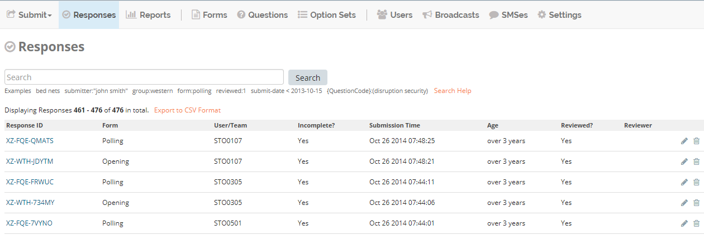
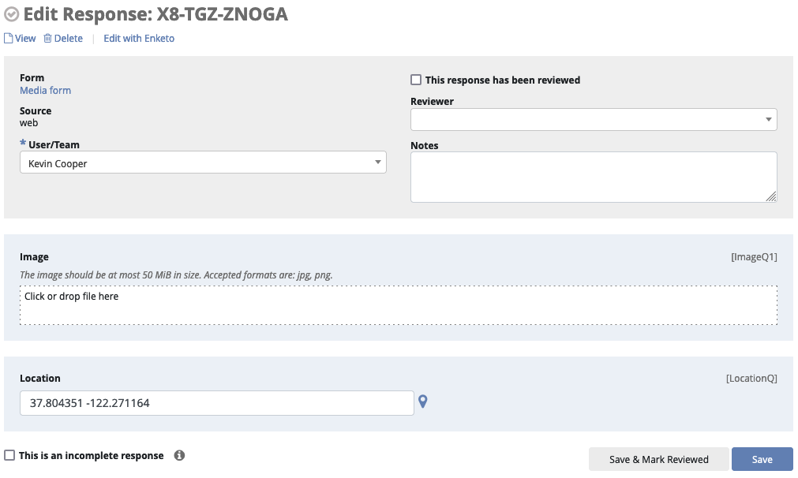
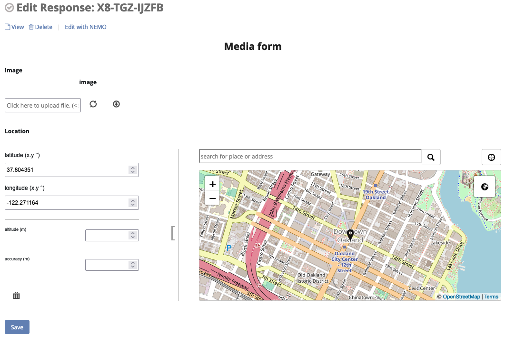

Review a response
=================

Basic flow
----------

1. Click :guilabel:`Responses` menu.
2. Click :fa:`pencil` on the same row as the response to be reviewed.

3. Make any necessary changes to the form.
4. Click :guilabel:`Save`.

NEMO Editor
-----------

In addition to editing the response answers, the NEMO editor also allows editing metadata about the submission:

1. Optionaly check the box :guilabel:`Reviewed?`.
2. Optionaly add :guilabel:`Reviewer Notes`.

Note you will not be able to interact with conditional logic, such as display/skip conditions, in the NEMO editor.

Enketo Editor
-------------

The `Enketo <https://enketo.org/>`_ editor is an open-source tool which has been integrated into the NEMO app.
Enketo supports conditional logic, such as display/skip conditions, even when reviewing existing responses.

Switching Between Editors
-------------

At any time, you can click the :guilabel:`View/Edit with Enketo` or :guilabel:`View/Edit with NEMO` link at the top of the page to switch between editors.

Note that Enketo currently only supports responses that have an associated XML file, which means it cannot be used to view responses made through the NEMO web form.
Similarly, if you edit a response with the NEMO web editor, those edits will not be visible in Enketo and you will see an earlier version of the form;
in this case a warning will appear at the top of the screen as a reminder.
