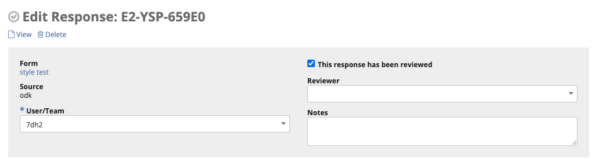

Review a response
=================

NEMO Editor
-----------

1. Click :guilabel:`Responses` menu.
2. Click :fa:`pencil` on the same row as the response to be reviewed.

.. image:: select-response.png
  :alt: Select response

3. Make any necessary changes to the form.
4. Check the box :guilabel:`Reviewed?` (not available in Enketo).
5. You can optionaly add :guilabel:`Reviewer Notes` (not available in Enketo).
6. Click :guilabel:`Save`.

Enketo Editor
-------------

WIP
