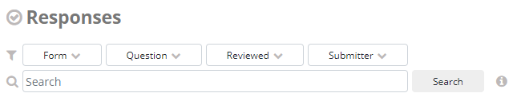
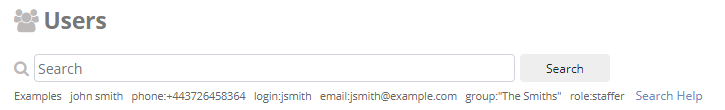

.. HTML line break definition
.. |br| raw:: html

    

Search
======

Responses filter component
--------------------------

Responses menu have a specific filter component with multiple dropdowns where you can filter by Form name, Question, Reviewed and Submitter.

- :guilabel:`Form` Select the name of the form.
- :guilabel:`Question` Filter by a specific value of a question, click :fa:`plus` :guilabel:`Add Condition` to add another question filter.
- :guilabel:`Reviewed` Select whether to show only reviewed responses, unreviwed responses, or both.
- :guilabel:`Submitter` Filter by a specic user or group.

Free search box
---------------

The free search box is available on responses, questions, users, and SMS menu. Below is the search box from users menu.

Operators
---------

You can combine search terms with operators for a more accurate search.

Operators in NEMO are: **AND, OR, NOT**\ ( ! or -), **grouping** operator (parentheses), and **phrase** operator (“”).

.. list-table::
   :widths: auto
   :header-rows: 1

   * - Operator
     - Description
   * - AND
     - By default, all terms in the search must be matched. |br| For example, :guilabel:`apples oranges bananas` is equivalent to :guilabel:`apples AND oranges AND bananas`.
   * - OR ( | )
     - Matches when any of the terms match. |br| Example :guilabel:`Household Form | Fruit Form` returns matches that are :guilabel:`Household Form` or :guilabel:`Fruit Form`.
   * - NOT (!= or -)
     - Matches when the first term matches, but the second one does not. |br| Example: :guilabel:`form != Household` returns the forms that are NOT Household. |br| Another example: :guilabel:`apple -oranges` matches any response with an answer containing the word apples but NOT the word oranges.
   * - (…)
     - Grouping parenthesis denotes the search terms boundaries. |br| Example: :guilabel:`(red | green | blue) pixel` is equivalent to :guilabel:`(red OR Green OR blue) AND pixel`.
   * - “…”
     - Quotes match when search terms match an exact phrase. |br| Example :guilabel:`submitter:"John Smith"`.

Qualifiers
----------

A qualifier is a word you add to an expression to specify where to
search. Example:

- **form: apples** within the responses menu will return all forms with the word **apples** in them.
- **type: long text** in the questions menu returns all questions of the long text type.

Available qualifiers depends on the menu you are in. They are listed below:

**Responses menu**

.. list-table::
   :widths: auto
   :header-rows: 1

   * - Qualifier
     - Function
   * - form:
     - The name of the form submitted.
   * - submitter:
     - The name of the user that submitted the response (partial matches allowed).
   * - submit-date:
     - The date the response was submitted (example: **submit-date: 1985-03-22**).
   * - reviewed:
     - Whether the response has been marked as **reviewed** (1 = yes or 0 = no).
   * - source:
     - The medium via which the response was submitted (Web, ODK Collect, or SMS).
   * - text:
     - Answers to textual questions.

**Questions menu**

.. list-table::
   :widths: auto
   :header-rows: 1

   * - Qualifier
     - Function
   * - code:
     - The question code (partial matches allowed).
   * - title:
     - The question title (partial matches allowed).
   * - type:
     - The question type (text, long-text, integer, decimal, location, select-one, select-multiple, datetime, date, time).
   * - tag:
     - Tags applied to the question.

**Users menu**

.. list-table::
   :widths: auto
   :header-rows: 1

   * - Qualifier
     - Function
   * - name:
     - The user’s full name.
   * - login:
     - The user’s username.
   * - email:
     - The user’s email address.
   * - phone:
     - The user’s phone number. No dashes or other punctuation, example: 1112223333.
   * - group:
     - The user group that the user belongs to.

**SMS menu**

.. list-table::
   :widths: auto
   :header-rows: 1

   * - Qualifier
     - Function
   * - content:
     - The message content (partial matches allowed).
   * - type:
     - The message type: incoming, reply, or broadcast (partial matches allowed).
   * - username:
     - The username of the sender or receiver (partial matches allowed).
   * - name:
     - The full name of the sender or receiver (partial matches allowed).
   * - number:
     - The phone number of the sender or receiver (partial matches allowed).
   * - date:
     - The date the message was sent or received. Example date:2015-01-29.
   * - datetime:
     - The date and time the message was sent or received. Use quotation marks and 24-hr time, example “2015-01-29 14:00”.
