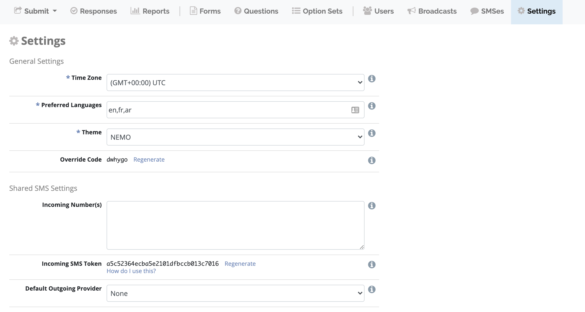
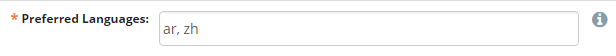

Settings
========

Settings are where you can define Elmo interface preferences and SMS information for each mission.

General Settings
----------------

Time zone
~~~~~~~~~~
Time zone in which times are displayed throughout the site.

Preferred languages
~~~~~~~~~~~~~~~~~~~~

Set the language(s) for the mission. This settings determines:

- The default language preference for new users.
- The default language for SMS replies.
- The languages for questions and options.

Enter the two-letter language code for the language (example: Arabic = ar; Chinese = zh). A list of ELMO compatible language 
codes can be found `here <http://www.loc.gov/standards/iso639-2/php/code_list.php>`_.
If multiple codes exist, type them in the preferred order of use and separate them with a comma (example: ar, zh).

In this example, the mission’s primary language will be Arabic. Chinese will be used where Arabic is not available.

Theme
~~~~~~

Choose a theme for the application. If you want to create a custom theme check the `instructions <https://github.com/thecartercenter/elmo/blob/master/docs/production-setup.md#custom-theme>`_. 

Override code
~~~~~~~~~~~~~~

Click :guilabel:`Generate` to set an override code. This code should be given to observers if the ability to send incomplete responses with ODK is needed. Check :ref:`override-code` for more details.

Click :guilabel:`Regenerate` to create a new override code. If generating a new code, please record the old code if there are previous live forms. The new code will only work for forms downloaded after the code is regenerated.

Allow Unauthenticated Submissions
~~~~~~~~~~~~~~~~~~~~~~~~~~~~~~~~~~

If checked :fa:`check-square` users will be able to send form responses without entering the authentication code.

Shared SMS Settings
-------------------

Incoming Number(s)
~~~~~~~~~~~~~~~~~~

Enter the phone number(s) including country code, separated by commas to which incoming SMSes for SMS forms should be sent. The phone number will be displayed on the SMS guide. Only needed if using SMS submissions.

Incoming SMS Token
~~~~~~~~~~~~~~~~~~

This token is included in the URL used by the incoming SMS provider to prevent the submission of unauthorized messages.
To get the URL click :guilabel:`How do I use this?`.

Default Outgoing Provider
~~~~~~~~~~~~~~~~~~~~~~~~~~~

The adapter used to send outgoing SMSes. More information can be found in :ref:`sms-provider` section.

External SQL
------------
The SQL code used to extract data for use in external applications. Click :guilabel:`Select All` then copy content to paste it in the external application.