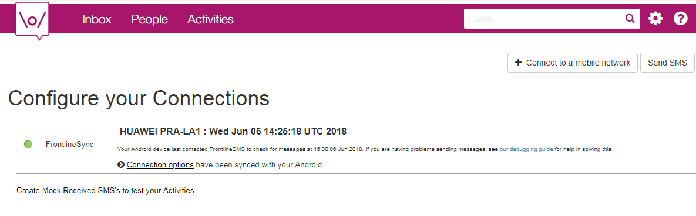
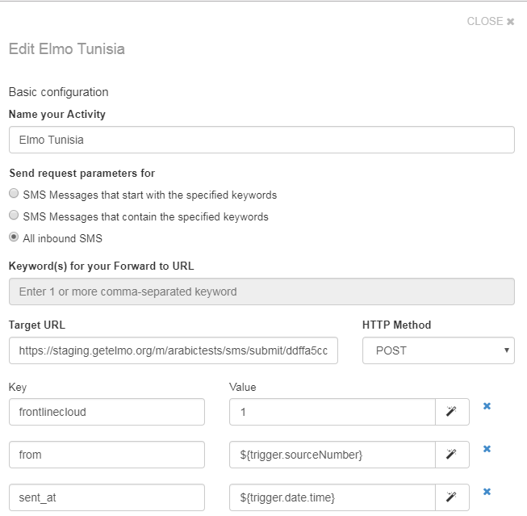
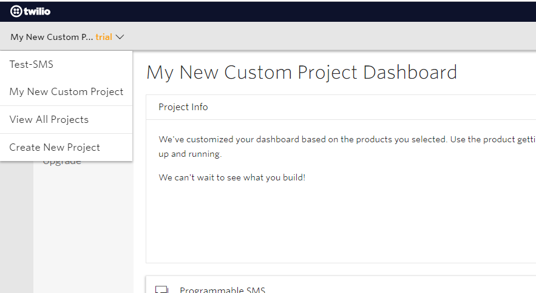
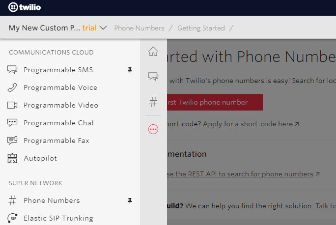
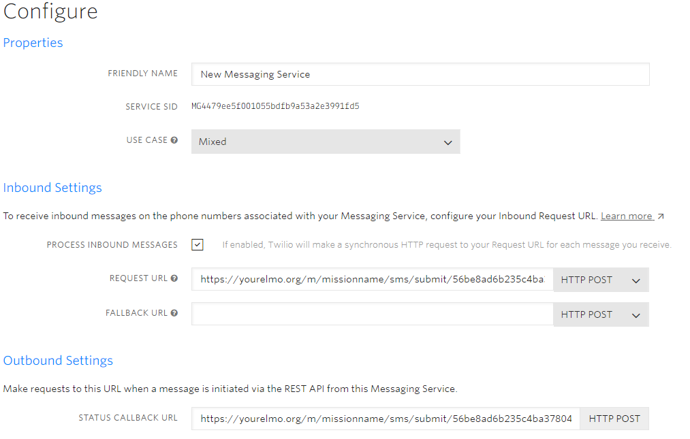

.. _sms-provider:

SMS Provider Setup
==================================

NEMO needs to be synced with an SMS provider in order to use the SMS feature. Three options are available:

- :ref:`frontline-sms`
- :ref:`twilio-sms`
- :ref:`Generic SMS adapter <generic-sms>`

.. _frontline-sms:

FrontlineSMS
-------------

You can turn your Android smartphone or tablet into a gateway using FrontlineSMS. For this you need to sign up for a `FrontlineCloud <https://www.frontlinesms.com/>`_ account.

Synchronize FrontlineSMS with your Android device
~~~~~~~~~~~~~~~~~~~~~~~~~~~~~~~~~~~~~~~~~~~~~~~~~~

1. Download `FrontlineSync <https://play.google.com/store/apps/details?id=com.simlab.frontlinesync&hl=en>`_ from the Play Store.
2. Open FrontlineSync app from your Android device.
3. Enter your FrontlineCloud email and password and press :guilabel:`CONNECT`.
4. Make sure :guilabel:`Send messages using this Androis` and :guilabel:`Upload incoming messages from FrontlineSync` are checked :fa:`check-square` then press :guilabel:`UPDATE`.
5. Then press :guilabel:`DONE! START USING FRONTLINESYNC`.

To test your setup:

1. Open your `FrontlineCloud account <https://cloud.frontlinesms.com>`_.
2. Click settings :fa:`cog` on the top right then click :guilabel:`Connections to mobile networks`.

You should now be able to see the device you have previously set up.

.. note ::

  For more details check `Frontline documentation <https://frontlinecloud.zendesk.com/hc/en-us/articles/208115663-Creating-a-FrontlineSync-Connection-to-FrontlineCloud>`_.

Synchronize FrontlineSMS with NEMO
~~~~~~~~~~~~~~~~~~~~~~~~~~~~~~~~~~~~~~~~~

Now that you have synchronized your Android device with FrontlineCloud, you will need to synchronize FrontlineCloud with NEMO.

**Set up a new activity**

1. On FrontlineCloud click :guilabel:`Activities`.
2. Click :guilabel:`Create an Activity`.
3. Select :guilabel:`Forward to URL`.
4. Type a name for your activity.
5. Select :guilabel:`All inbound SMS`.
6. To get the :guilabel:`Target URL`, get back to your NEMO mission, click :guilabel:`Settings` then in the :guilabel:`Incoming SMS Token` section click :guilabel:`How do I use this?` and copy the URL that shows up in the dialog.
7. Make sure :guilabel:`HTTP Method` is set to **POST**.
8. Now set the following key-value pairs:

+------------------+-------------------------------+
|   Key            |   Value                       |
+==================+===============================+
|   from           |   ${trigger.sourceNumber}     |
+------------------+-------------------------------+
| frontlinecloud   | 1                             |
+------------------+-------------------------------+
| sent\_at         | ${trigger.date.time}          |
+------------------+-------------------------------+
| body             | ${trigger.text}               |
+------------------+-------------------------------+

9. Click :guilabel:`Save`.

**Generate an API Key**

1. Click settings :fa:`cog` on the top right then click :guilabel:`API web services and Integrations`.
2. Click :guilabel:`Connect a web service`.
3. Select :guilabel:`Connect an external web service to your workspace`.
4. Enter a name for the web service.

A new row will appear on the screen with an API Key in the :guilabel:`Details`. We will need this API Key for the next step.

**NEMO setup**

1. Click :guilabel:`Settings` menu.
2. Add the SIM card number to the :guilabel:`Incoming Number(s)` field. If adding more than one number, separate the numbers with a comma.
3. Set :guilabel:`Default Outgoing Provider` to **FrontlineCloud**.
4. In :guilabel:`FrontlineCloud Settings` click :guilabel:`Change API Key`.
5. Paste the :guilabel:`API Key` that you previously generated in FrontlineCloud.

.. _twilio-sms:

Twilio
------

If you are using `Twilio <https://www.twilio.com>`_ as your SMS provider you need to set the following settings:

Twilio settings
~~~~~~~~~~~~~~~

Once you have created your Twilio account you will need to:

- :ref:`create-twilio-project`.
- :ref:`create-phone-number`.
- :ref:`create-msg-service`.

.. _create-twilio-project:

Create a new Twilio project
"""""""""""""""""""""""""""

To create a new Twilio project:

1. Click on the top left menu :fa:`chevron-down`.
2. Select :guilabel:`Create New Project`.

3. Select :guilabel:`Products` then choose :guilabel:`Programmable SMS`.
4. Click :guilabel:`Continue`.

.. _create-phone-number:

Set up a Twilio phone number
""""""""""""""""""""""""""""

1. Click :fa:`ellipsis-h` on the left navigation to see the list of products and services.
2. Select :fa:`hashtag` :guilabel:`Phone Numbers`.

3. Once in the Phone Numbers menu, you have three options:

- Get a free number from Twilio by going to :guilabel:`Getting Started` section.
- Buy a Twilio Number by going to :guilabel:`Buy a Number` section.
- Use your own Number by going to :guilabel:`Use Your Number` section.

.. _create-msg-service:

Create a new Messaging service
""""""""""""""""""""""""""""""

You need to create a new messaging service in order to forward all incoming SMSes to NEMO, for this:

1. Click :fa:`comment-alt` :guilabel:`Programmable SMS` on the left navigation.
2. Click :guilabel:`SMS` on the left menu.
3. Click :fa:`plus-circle` to create a new messaging service.
4. Choose a name for the service and set the :guilabel:`use case` to Mixed.
5. Click :guilabel:`Create`.
6. Under Inbound Settings, check :guilabel:`PROCESS INBOUND MESSAGES`.
7. To get the :guilabel:`REQUEST URL`, get back to your NEMO mission, click :guilabel:`Settings` then in the :guilabel:`Incoming SMS Token` section click :guilabel:`How do I use this?` and copy the URL that shows up in the dialog.
8. Outbound Settings should be left blank.

At the end you should have a configuration similar to this one:

9. Click :guilabel:`Save`.
10. Now you need to add a number to this messaging service, for this, Click :guilabel:`Numbers` on the left menu.
11. Click :fa:`plus-circle` to add a number.

NEMO setup for Twilio
~~~~~~~~~~~~~~~~~~~~~~~~~~

In your NEMO mission:

1. Click :guilabel:`Settings`.
2. Add the phone number from which you will receive SMSes to :guilabel:`Incoming Number(s)` field. If adding more than one number, separate the numbers with a comma.
3. Make sure the :guilabel:`Default Outgoing Provider:` is set to :guilabel:`Twilio`.
4. Scroll down to :guilabel:`Twilio Settings` section, set the :guilabel:`Outgoing Number` which is the phone number registered with Twilio. SMS replies and Outgoing SMS broadcasts won’t work unless this number is owned by your Twilio account. This number must include the country code. Example: +25680344523.
5. Set the :guilabel:`Account SID` for your twilio account.
6. Click :guilabel:`Change Auth Token` to change the auth token for the Twilio account.
7. Click :guilabel:`Save`.

.. _generic-sms:

Generic SMS Adapter Settings
----------------------------

If you are using a provider other than Twilio and FrontlineSMS you will need to set up a Generic SMS Adapter.

1. Click :guilabel:`Settings` on your NEMO mission.
2. Make sure the :guilabel:`Default Outgoing Provider:` is set to :guilabel:`none`.
3. In :guilabel:`Generic SMS Adapter Settings` set a JSON formatted configuration string for the generic adapter. Example :

.. code-block:: javascript

  {
    "params": {
      "from": "num",
      "body": "msg"
    },
    "response": "<message>%{reply}</message>"
  }
