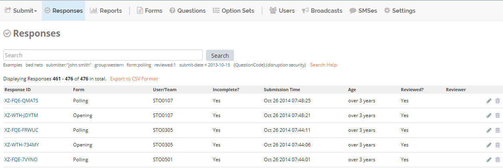
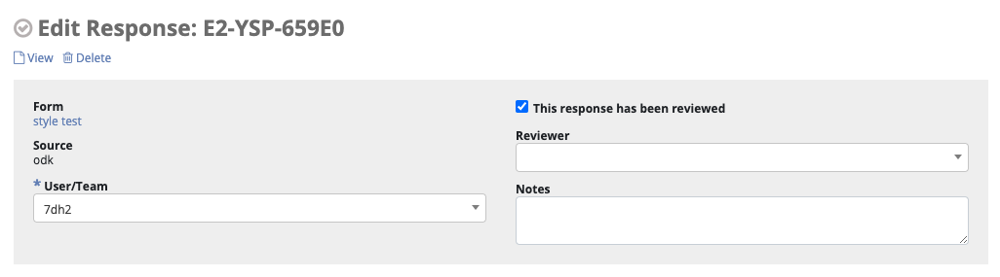

Web
===

Submit form
-----------

To submit a form online:

1. Click on :guilabel:`Submit` in the menu bar.
2. Select a form from the drop down list.
3. Fill the form.
4. Click :guilabel:`Save`.

.. image:: submit-form.png
  :alt: Submit form

Review a response
-----------------

1. Click on :guilabel:`Responses` menu.
2. Click the :guilabel:`pencil icon` on the same row as the response to be reviewed.

3. Make any necessary changes to the form.
4. Check the box :guilabel:`Reviewed?`.
5. You can optionaly add :guilabel:`Reviewer Notes`.
6. Click :guilabel:`Save`.

