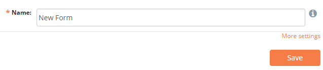
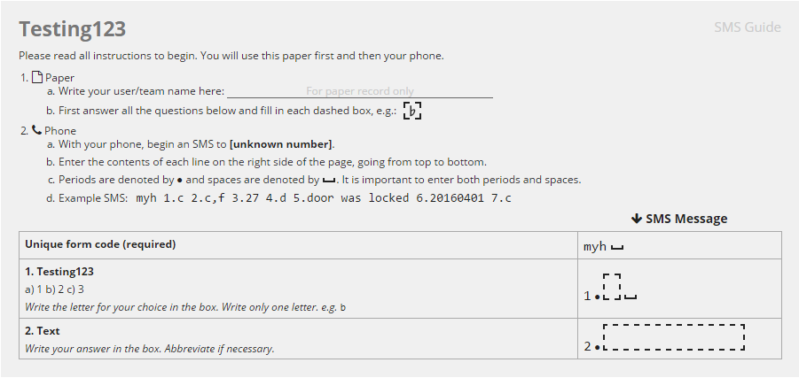
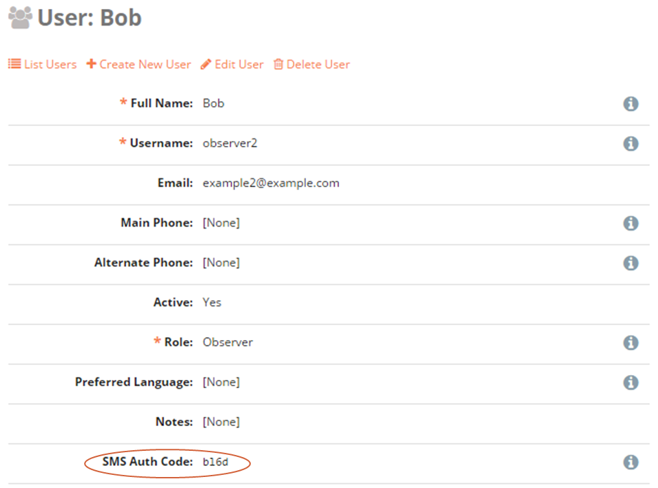
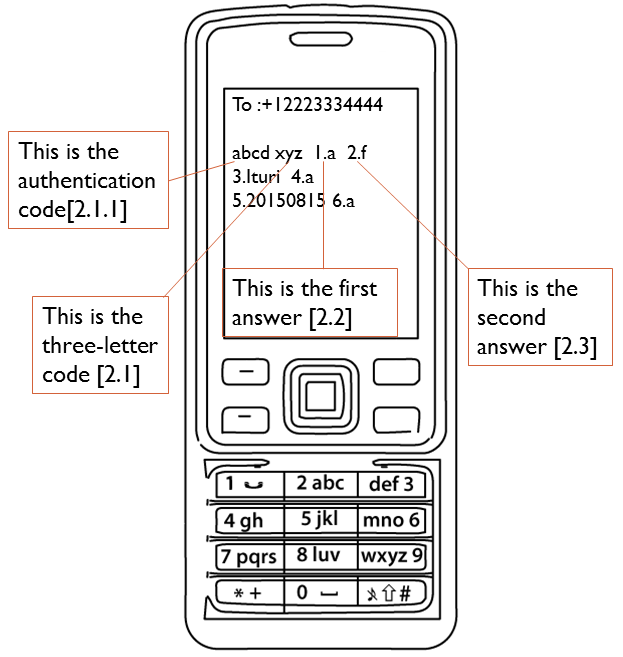

SMS
===

Forms can be submitted via SMS. Any mobile phone with SMS capability and access to a cellular network can be used to submit data to ELMO.

Given the space limitations of texts, SMS-based forms are most powerful when designed carefully. Certain types of questionnaires, such as qualitative ones with long-text answers, are usually not a good fit.
However, SMS form submission allows the easy aggregations of large amounts of data across distances without good mobile or internet coverage. It also can be cheaper per user, and may suit certain monitoring and evaluation purposes, quantitative inquiries, or simple surveys.

.. _smsable:

SMSable form
------------

By default, SMS form submission is not activated, to do so you need to:

1. Click :guilabel:`Forms` menu.
2. Create or edit an existing form.
3. Click :guilabel:`More settings`.

4. Check the box :guilabel:`SMSable?`.

.. note::

  When checking :guilabel:`SMSable?`, two new options are available:

  - :guilabel:`SMS Forwarding?` check this box if you want to forward all incoming SMS to a user or a group of users.
  - :guilabel:`Authenticate SMS?` if checked, incoming SMS needs to contain users authentication code. More information can be found :ref:`below <smsauth>`.

SMS submission guide
--------------------

An SMS submission guide is generated for all **SMSable** forms, to access the instructions:

1. Click :guilabel:`Forms` menu.
2. Select the form from the list.
3. Click on :guilabel:`View SMS Guide`.

An example of the guide is shown below:

.. _smsauth:

SMS authentication
------------------

ELMO only accepts form submissions from users having phone numbers pre-registered in their profiles. SMS Authentication feature, when enabled, works by requiring users to provide an additional code when submitting forms via SMS.

This four-character code is randomly assigned and unique to each user. It is generated when a user is created. The code can be found by clicking on the :guilabel:`Users` menu and then on the name of the user.

To generate a new authentication code:

1. Click :guilabel:`Edit User`.
2. Click :guilabel:`Regenerate`.
3. Click :guilabel:`Save`.

Activating SMS authentication adds extra security to ELMO by ensuring that the registered phone number and the authentication code belong to the same user. All SMS submissions that do not meet both these conditions are rejected.

Submitting SMS responses
------------------------

To submit forms to ELMO via SMS, the following is required:

- Mobile phone.
- Phone credit.
- :ref:`SMS-able ELMO form <smsable>` with three letter unique code listed in the SMS Composition Guide.
- The ELMO number to which the SMS will be submitted.

To submit a form:

1. Type the ELMO phone number.
2. If the user authentication code is required, type the code followed by a space.
3. Type the form code followed by a space.
4. For each question, type the number of the question followed by the answer selected followed by a space.
5. **Send** the message.

.. note::
  If not answering a question, skip that question number in the SMS. For example, if question 4 is not being answered, the message would look like :guilabel:`xyz 1.a  2.f 3.Ituri 5.20150815 6.a`.

   
