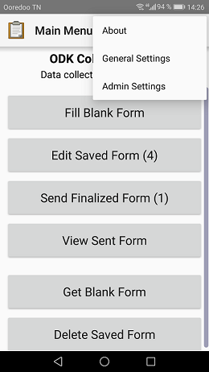
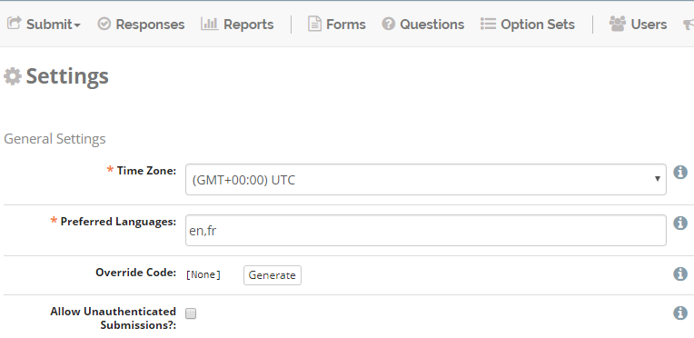
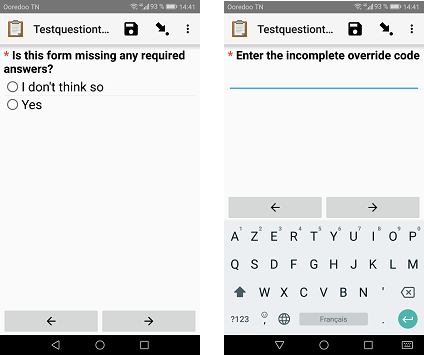
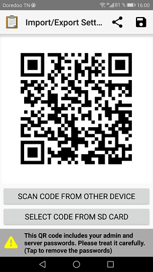

ODK Collect
===========

NEMO/ELMO forms can be submitted via Android devices with **ODK Collect**.
`The ODK Collect App is available in the Google Play store <https://play.google.com/store/apps/details?id=org.odk.collect.android&hl=en>`_.

Setup ODK Collect
-----------------

1.  Open :guilabel:`ODK Collect` app from your Android device.
2.  From the action button (:guilabel:`⋮`), select :guilabel:`General Settings`.

3.  Select :guilabel:`Server`.
4.  Make sure :guilabel:`Type` is set to :guilabel:`ODK Aggregate`.
5.  Type the :guilabel:`URL` of the mission, example https://example.getelmo.org/en/m/missionname.
6. Type your NEMO/ELMO :guilabel:`Username` and :guilabel:`Password`.

Download forms
--------------

Forms must be downloaded to ODK Collect before they can be submitted. To download a form:

1. On the ODK Collect home screen, press :guilabel:`Get Blank Form`.

.. note::
  A box may pop up asking for confirmation of username and password. If already setup in General Settings, press :guilabel:`OK`.

2. Check the box next to the forms you want to download.
3. Press :guilabel:`Get Selected`.

.. note::
  When forms are updated in ELMO they need to be downloaded again to ODK Collect.

Submit forms
------------

1. On the ODK Collect home screen, press :guilabel:`Fill Blank Form`.
2. Select a form from the list.
3. Fill the form.
4. On the last screen press :guilabel:`Save Form and Exit`.
5. On the ODK Collect home screen, press :guilabel:`Send Finalized Form`.
6. Check the box next to the forms you want to submit.
7. Press :guilabel:`Send Selected`.

.. note ::

  - When obtaining GPS locations, stand outdoors. If indoors, stand by the nearest window.
  - On the last screen, if you want to be able to edit the form again before submission, you need to uncheck the box :guilabel:`Mark form as finalized` before pressing :guilabel:`Save Form and Exit`.

Edit forms before submission
----------------------------

1. On ODK Collect home screen, press :guilabel:`Edit Saved Form`.
2. Select the form to be edited.
3. Select a question from the list to change its answer, or press :guilabel:`Go To Start` to
   review each question from the beginning.
4. When finished editing, check the box :guilabel:`Mark form as finalized` before pressing :guilabel:`Save Form and Exit`.

.. _override-code:

Override code
-------------

If you need to finalize and send forms having required questions not answered, you have to use an **override code**. This code is found on the settings page of each mission.

To generate an Override code:

1. Click :guilabel:`Settings` menu.
2. If the :guilabel:`Override Code` is :guilabel:`None`, click :guilabel:`Generate` to generate a new code.

.. note::

  In order to use the override code, forms must be set to allow for incomplete responses. When creating or editing a form, check the box **Allow Incomplete?**. If not initially set, forms have to be downloaded again to ODK Collect in order to take effect.

When submitting a form that allows incomplete responses a question will show up at the end saying **Is this form missing any required answers?**

- :guilabel:`I don't think so` will direct you to the next screen to save and exit the form.
- :guilabel:`Yes` you will be asked to enter the override code.

Import/Export settings
----------------------

It is possible to share ODK Collect settings between multiple devices using QR code configuration. On your reference device:

1. Press the action button (:guilabel:`⋮`).
2. Select :guilabel:`Admin Settings`.
3. Select :guilabel:`Import/Export settings`.

Scan code from other device
~~~~~~~~~~~~~~~~~~~~~~~~~~~~

From the device that need to be configured press :guilabel:`Scan code from other device`. This will show a QR code scanner that you can use to scan the code from the reference device. Once the code is successfully scanned, Collect will return to the landing screen with a message saying settings were successfully loaded.

Share QR Code
~~~~~~~~~~~~~~

You can share your settings QR code as an image, for this:

1. Tap :fa:`share-alt` on the top right of the screen.
2. Select an application from the list.

.. note::

  The QR code contains all of the settings including your passwords. If you want to exclude these:

  1. Tap the bottom of the screen.
  2. Uncheck passwords.

  .. image:: uncheck-passwords.png
    :alt: Uncheck passwords

Select code from SD card
~~~~~~~~~~~~~~~~~~~~~~~~

If you already have the QR code settings as an image:

1. Tap :guilabel:`Select code from SD card`.
2. Select your QR code image.

.. note::
  
  For more details about Import/Export settings see `ODK Collect documentation <https://docs.opendatakit.org/collect-import-export/>`_.