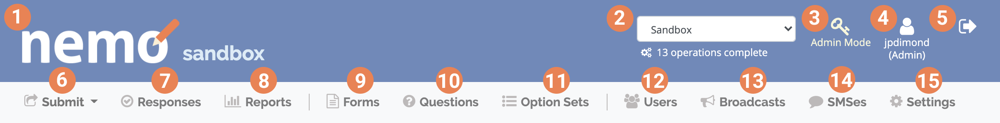
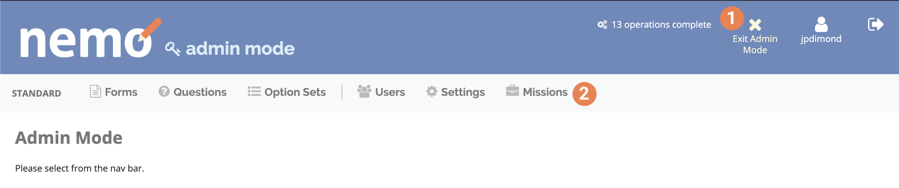
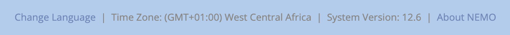
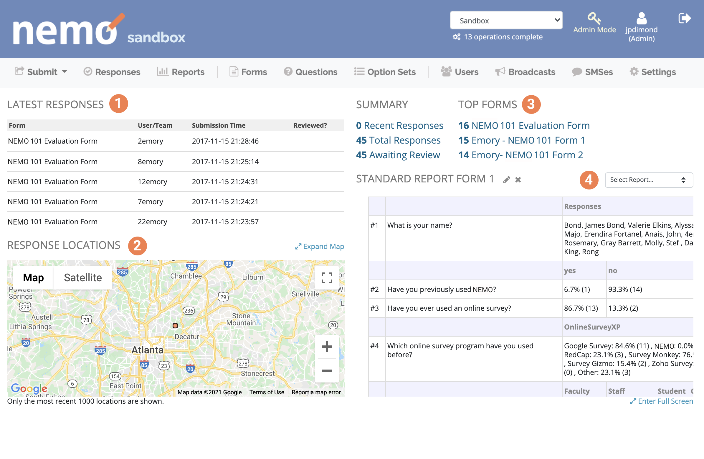

Menu Bar & Home Screen
======================

Viewing the header
------------------

The header is the top section of the screen. Here are its components:

1.  **ELMO/NEMO** icon. Click to return to the home page of the
    selected field project or mission.
2.  **Mission** selection box. Click to display all missions that
    can be accessed by the user. Click on a mission to go to its home
    page.
3.  **Admin Mode** icon (Admins only). Click to enter Admin
    Mode. The header in this mode looks different, but the function of
    each icon is the same.
4.  **Edit profile** icon. The icon shows your username and role. Click to edit your profile.
5.  **Logout** icon. Click to log out of ELMO.
6.  **Submit** menu. Click to display a list of all published
    forms within the current mission. Click a form to fill it out and
    submit it.
7.  **Responses** menu. Click to go to the responses page,
    which shows all responses that have been submitted to all forms
    within the mission.
8.  **Reports** menu. Click to go to the reports page, where
    you can generate reports and see all of the reports that have
    already been generated within the mission. More info on the :doc:`../reports/reports` section.
9.  **Forms** menu. Click to go to the forms page, where you
    can create and import forms and see the list of available :doc:`../formsoverall/formsoverall`.
10. **Questions** menu. Click to go to the Questions page,
    where you can create and import questions and see the list of available :doc:`../formsquestions/formsquestions`.
11. **Option Sets** menu. Click to go to the option sets page,
    where you can create or import option sets and see list of available :doc:`../formsoptionsets/formsoptionsets`.
12. **Users** menu. Click to go to users page. See :doc:`../users/users` section for more details.

13. :doc:`../broadcast/broadcast` menu. Click to go to the broadcasts page,
    where you can send a broadcast to users and view broadcasts that
    have already been sent.
14. **SMS** menu. Click to view all SMSes that have been sent
    and received by ELMO.
15. :doc:`../settings/settings` menu. Click to view and change your personal
    settings.

This is the version that admins will see in Admin Mode:

There are only two new components:

1. The **Exit Admin Mode** icon. Click this to exit admin mode.
2. The **Missions** menu. Click this to go to the missions page, where
   you can create a new mission and see all missions that have already
   been created.

Viewing the footer
------------------

The footer is the bottom section of the screen. Here are its components:

1. Click **Change Language** to reveal a list of all languages available.
2. The time zone the user has selected. This can be changed in the
   settings menu.
3. The outgoing SMS provider for the current mission (not shown in Admin
   mode). See :doc:`../smssetup/smssetup`.
4. The current version number of ELMO.
5. Click on **About ELMO** to go to getelmo.org.

.. note::

  ELMO online languages are slowly being built and
  increasing through volunteer efforts. It both supports Right to Left and Left to Right languages.
  ELMO is multilingual ready (ISO 639-2 standard) for questions and forms. The list of available
  languages is
  `here <https://www.loc.gov/standards/iso639-2/php/code_list.php>`__.

Viewing the dashboard
---------------------

The first visible screen when logged into ELMO is the dashboard. This
feature gives an overview of data gathered from responses to forms.
Visible on the dashboard screen are:

1. Recent form responses.
2. An overview of geographic data submitted with responses.
3. An overview of all form submissions.
4. All reports created in the mission.

.. note::
  The report with the most views will appear at the initial Dashboard screen.
