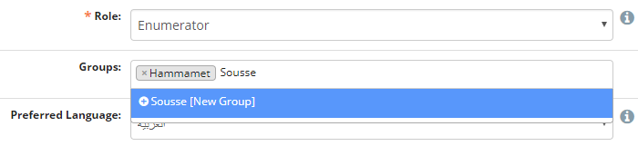
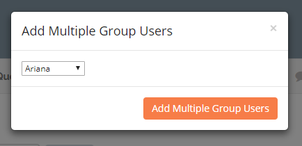
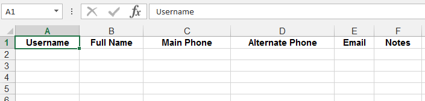

User Management
===============

User permission levels
----------------------

NEMO has four user levels – Enumerator, Staffer, Coordinator, and
Admin. Each user level has a different set of permissions based
on the functions they are expected to perform during the missions.

.. list-table::
   :header-rows: 1
   :widths: auto
   :align: left

   * - Role
     - Responsibility
     - Privileges
   * - Enumerator
     - Collects and submits data from the field.
     -
         * Fill form responses via android devices, via SMS, or NEMO online platform.
         * Edit own user information.
         * Generate reports (only from user's own submitted data).
   * - Reviewer
     - Review collected data and performs real-time analysis.
     -
         * All Enumerator privileges.
         * Review responses submitted by users.
         * Generate reports from data submitted by users.
   * - Staffer
     - Communicates with staff deployed to the field.
     -
         * All Reviewer privileges.
         * Broadcast SMS messages to users.
         * Delete responses.
   * - Coordinator
     - Designs forms/checklists, reporting structures, and manages users for a specific mission.
     -
         * All Staffer privileges.
         * Create option sets, questions, and forms for the mission.
         * Create, edit and delete users within a mission.
   * - Administrator
     - Designs standardized forms/checklists and manages processes accross several missions.
     -
         * All Coordinator privileges.
         * Create new missions.
         * Create standard option sets, standard questions, and standard forms to be shared/imported across all missions.

Create users
------------

Create, delete, edit, and manage users on the users page. Administrators
can create general users in Admin Mode and assign them to specific
missions, or they can create users for specific missions in Mission
Mode. Coordinators can only create new users in Mission Mode.

To create new users:

1. Determine whether to work in Admin Mode or Mission Mode.
2. Navigate to the users page by clicking :guilabel:`Users` on the
   main menu.
3. Click :guilabel:`Create User`.
4. Enter the new user's information.
5. Click :guilabel:`Save`.

Import users
---------------------

You can import multiple users from a CSV file (you can export from XLS to CSV from any standard spreadsheet software).

1. From the Users page, click :guilabel:`Import Users`.
2. Click one of the links to download a template :guilabel:`CSV` file.
3. Assemble your user data in the template.
4. In your browser, select the spreadsheet file to upload.
5. Click :guilabel:`Import`.

.. note::
   Available columns are: Username, Full Name, Main Phone, Alternate Phone, Email, Birth Year, Gender, Nationality, Notes, and Groups. Only the Username and the Full Name are required, the other columns are optional.
   |Import Users|

Manage existing users
---------------------

To edit existing user information:

1. Find the user in the list of users.
2. Click :fa:`pencil` located on the same line.

To delete existing users:

1. To delete a single user, click :fa:`trash`.
2. To delete multiple users, check the boxes to the left of their names and click :guilabel:`Delete Multiple Users`.

Export in vCard format
----------------------

To export users information to a vCard, which is readable by most contact list applications:

1. Check the box next to the name of each user to be exported.
2. Click :guilabel:`Export as vCard`.

User groups
-------------

Placing users into groups makes it easier to search for users and send broadcasts to them. To add a user to a group:

1. Click :guilabel:`Users` menu.
2. Click :fa:`pencil` to edit a user.
3. In :guilabel:`Groups` input, select an existing group from the list or type the name of a new one then click **Enter**.

4. Click :guilabel:`Save` when finished editing.

To add multiple users to an existing group:

1. Click :guilabel:`Users` menu.
2. Check the box :fa:`check-square` next to the users you want to add.
3. Click :guilabel:`Add Multiple Group Users`.
4. Select the group then click :guilabel:`Add Multiple Group Users`.

