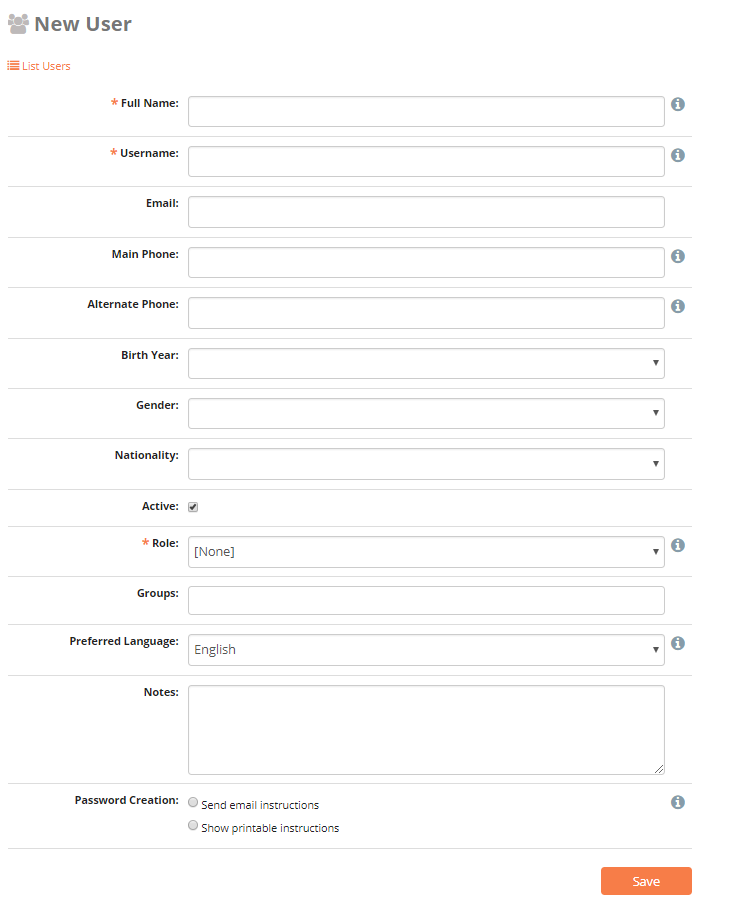

.. HTML line break definition
.. |br| raw:: html

    

.. _users:

User Management
===============

User Permission Levels
----------------------

ELMO has four kinds of user levels – observer, staffer, coordinator, and
administrator. Each user level has a different set of permissions based
on the functions they are expected to perform during ELMO missions.

.. list-table::
   :header-rows: 1
   :widths: auto
   :align: left

   * - Role
     - Responsibility
     - Privileges
   * - Observer
     - Collects and submits data from the field
     - 
         * Complete responses to published |br| forms via android devices, via SMS, |br| or ELMO online platform
         * Edit own user information
         * Generate reports (only from user's |br| own submitted data)
   * - Staffer
     - Performs real-time analysis and |br| communicates with staff deployed |br| to the field
     - Observer privileges plus:
         * Generate reports from data |br| submitted by users
         * Broadcast SMS messages to users
   * - Coordinator
     - Designs forms/checklists, reporting |br| structures, and manages users for a |br| specific mission
     - Staffer privileges plus:
         * Create option sets, questions, |br| and forms for the mission
         * Create, edit and delete users |br| within a mission
   * - Administrator
     - Designs standardized forms/checklists |br| and manages processes accross |br| several missions
     - Coordinator privileges plus:
         * Create new missions
         * Create standard option sets, |br| standard questions, and standard |br| forms to be shared/imported |br| across all missions

Create Users
------------

Create, delete, edit, and manage users on the Users page. Administrators
can create general users in Admin Mode and assign them to specific
missions, or they can create users for specific missions in Mission
Mode. Coordinators can only create new users in Mission Mode.

To create new users:

1. Determine whether to work in Admin Mode or Mission Mode,
2. Navigate to the Users page by clicking the **Users menu** on the
   main menu
3. Click Create User (located in orange text below the search bar)

   |New-user|
4. Enter the new user informations on the **Create User** page

.. note::
  user’s phone number must include country code

5. Click **Save.**

Create Multiple Users (ideal for adding a large number of users)
----------------------------------------------------------------

1. Click **Create Multiple Users**
2. Upload a spreadsheet with information for the new users.

.. note::
   Click **Spreadsheet template** to download an example spreadsheet with the correct formatting for uploading multiple users.
   |Create Multiple Users|

3. Click Import.

Manage Existing Users
---------------------

To edit existing user information:

   1. find the user in the list of users
   2. Click on the **Pencil icon** located on the same line
   3. Click **Save**

To delete existing users:

   * To delete a single user, click the **Trashcan icon**
   * To delete multiple users, check the box to the left of their names and click **Delete Multiple Users.**

To send an email or SMS broadcast to users:

   1. Check the boxes next to each user to contact
   2. Click **Send Broadcast**. This
      redirects to a page where you can define the medium, subject, and content of the broadcast.

Export VCard
------------

To export users information to a vCard, which is readable in Microsoft Outlook:

1. Find each user whose vCard will be exported
2. Check the box to the left of their names
3. Click on Export as vCard

User Groups
-----------

Placing users into groups makes it easier to search for users and send
broadcasts to them. To create a group of users:

1. Add multiple users to a mission
2. Click the \ **Users** tab
3. Check the box next to each user to be placed into the group
4. Click \ **Add Users to Group**
5. Click \ **Create New User Group**
6. Type the name of the group and click \ **OK**
7. Click the name of the group

To add users to a preexisting group, follow the same steps as above, but
skip numbers 5 and 6.

To view user groups, go to the \ **Users** tab and click \ **List
User Groups**. In the list, you can click:

- **List Members**: to view a list of all users in the group
- **Pencil** **icon** : to change the name of the user group
- **Trashcan** **icon** : to delete the user group

.. |Create Multiple Users| image:: Create-Multiple-Users.png
